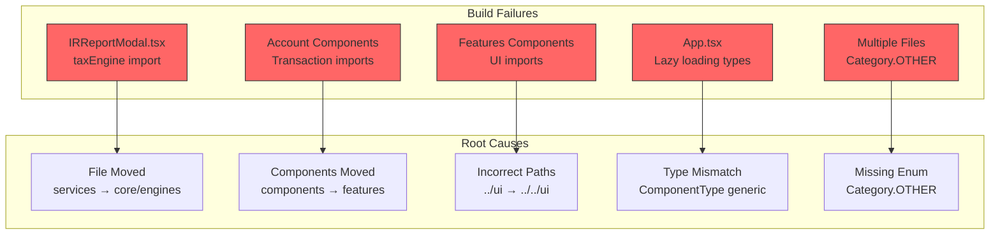
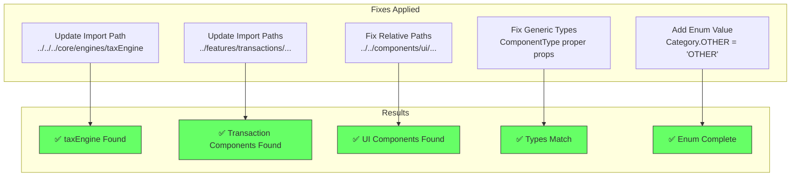

# Design Document: Build Fixes

## Overview

Este documento descreve as soluções técnicas específicas para corrigir os erros de build que impedem o deploy no Vercel. O foco é em correções cirúrgicas e precisas que restaurem a funcionalidade de build sem afetar a lógica de negócio existente.

A estratégia é de **correções mínimas e seguras**:
- Corrigir apenas os imports quebrados
- Adicionar apenas os tipos/valores ausentes
- Não alterar lógica de negócio existente
- Manter compatibilidade total com código atual

## Architecture

### Problemas Identificados



### Soluções Propostas



## Components and Interfaces

### 1. Import Path Corrections

#### TaxEngine Import Fix

```typescript
// ❌ Current (Broken)
import { calculateTaxReport } from '../../../services/taxEngine';

// ✅ Fixed
import { calculateTaxReport } from '../../../core/engines/taxEngine';
```

#### Transaction Components Import Fixes

```typescript
// ❌ Current (Broken)
import TransactionDeleteModal from '../transactions/TransactionDeleteModal';
import TransactionList from '../transactions/TransactionList';
import InstallmentAnticipationModal from './transactions/InstallmentAnticipationModal';

// ✅ Fixed
import TransactionDeleteModal from '../../features/transactions/TransactionDeleteModal';
import TransactionList from '../../features/transactions/TransactionList';
import InstallmentAnticipationModal from '../../features/transactions/InstallmentAnticipationModal';
```

#### UI Components Import Fixes

```typescript
// ❌ Current (Broken) - Features trying to import UI
import { Card } from '../ui/Card';
import { Button } from '../ui/Button';

// ✅ Fixed - Correct relative paths from features
import { Card } from '../../components/ui/Card';
import { Button } from '../../components/ui/Button';
```

### 2. TypeScript Type Corrections

#### Lazy Loading Component Types

```typescript
// ❌ Current (Broken)
const Dashboard = lazy(() => import('./features/dashboard/Dashboard'));
// Type: Promise<{ default: ComponentType<unknown> }>
// Actual: Promise<{ default: FC<DashboardProps> }>

// ✅ Fixed - Proper generic typing
const Dashboard = lazy(() => import('./features/dashboard/Dashboard') as Promise<{ default: ComponentType<DashboardProps> }>);

// Or better - explicit component interface
interface LazyComponent<T = {}> {
  default: ComponentType<T>;
}

const Dashboard = lazy((): Promise<LazyComponent<DashboardProps>> => 
  import('./features/dashboard/Dashboard')
);
```

#### Component Props Type Fixes

```typescript
// ❌ Current (Broken) - Props not matching interface
<Dashboard 
  accounts={accounts}
  projectedAccounts={projectedAccounts}
  // ... other props
/>

// ✅ Fixed - Ensure props match DashboardProps interface
interface DashboardProps {
  accounts: Account[];
  projectedAccounts: Account[];
  transactions: Transaction[];
  // ... all required props
}
```

### 3. Missing Enum Values

#### Category Enum Extension

```typescript
// ❌ Current (Incomplete)
export enum Category {
  ALIMENTACAO = 'ALIMENTAÇÃO',
  TRANSPORTE = 'TRANSPORTE',
  SAUDE = 'SAÚDE',
  // ... other categories
  // Missing OTHER
}

// ✅ Fixed - Add missing OTHER category
export enum Category {
  ALIMENTACAO = 'ALIMENTAÇÃO',
  TRANSPORTE = 'TRANSPORTE',
  SAUDE = 'SAÚDE',
  // ... other categories
  OTHER = 'OUTROS'
}
```

### 4. Missing Component Implementations

#### Transaction Components Location Map

```typescript
// Components that need to be accessible:
const TRANSACTION_COMPONENTS = {
  // From: src/components/transactions/ (old location)
  // To: src/features/transactions/ (new location)
  'TransactionDeleteModal': 'src/features/transactions/TransactionDeleteModal.tsx',
  'TransactionList': 'src/features/transactions/TransactionList.tsx',
  'InstallmentAnticipationModal': 'src/features/transactions/InstallmentAnticipationModal.tsx',
  'TransactionForm': 'src/features/transactions/TransactionForm.tsx',
  'SplitModal': 'src/features/transactions/SplitModal.tsx'
};
```

## Data Models

### Import Resolution Map

```typescript
interface ImportFix {
  file: string;
  currentImport: string;
  fixedImport: string;
  reason: string;
}

const IMPORT_FIXES: ImportFix[] = [
  {
    file: 'src/components/investments/modals/IRReportModal.tsx',
    currentImport: '../../../services/taxEngine',
    fixedImport: '../../../core/engines/taxEngine',
    reason: 'taxEngine moved from services to core/engines'
  },
  {
    file: 'src/components/accounts/BankingDetail.tsx',
    currentImport: '../transactions/TransactionDeleteModal',
    fixedImport: '../../features/transactions/TransactionDeleteModal',
    reason: 'Transaction components moved to features folder'
  },
  {
    file: 'src/components/accounts/BankingDetail.tsx',
    currentImport: '../transactions/TransactionList',
    fixedImport: '../../features/transactions/TransactionList',
    reason: 'Transaction components moved to features folder'
  },
  {
    file: 'src/components/accounts/CreditCardDetail.tsx',
    currentImport: '../transactions/TransactionDeleteModal',
    fixedImport: '../../features/transactions/TransactionDeleteModal',
    reason: 'Transaction components moved to features folder'
  },
  {
    file: 'src/components/accounts/CreditCardDetail.tsx',
    currentImport: '../transactions/TransactionList',
    fixedImport: '../../features/transactions/TransactionList',
    reason: 'Transaction components moved to features folder'
  },
  {
    file: 'src/components/Shared.tsx',
    currentImport: './transactions/TransactionDeleteModal',
    fixedImport: '../features/transactions/TransactionDeleteModal',
    reason: 'Transaction components moved to features folder'
  },
  {
    file: 'src/components/Accounts.tsx',
    currentImport: './transactions/InstallmentAnticipationModal',
    fixedImport: '../features/transactions/InstallmentAnticipationModal',
    reason: 'Transaction components moved to features folder'
  }
];
```

### UI Import Fixes Map

```typescript
const UI_IMPORT_FIXES: ImportFix[] = [
  // Features components trying to import UI
  {
    file: 'src/features/dashboard/CashFlowChart.tsx',
    currentImport: '../ui/Card',
    fixedImport: '../../components/ui/Card',
    reason: 'UI components are in components/ui, not features/ui'
  },
  {
    file: 'src/features/dashboard/CashFlowChart.tsx',
    currentImport: '../ui/SimpleCharts',
    fixedImport: '../../components/ui/SimpleCharts',
    reason: 'UI components are in components/ui'
  },
  {
    file: 'src/features/dashboard/CategorySpendingChart.tsx',
    currentImport: '../ui/Card',
    fixedImport: '../../components/ui/Card',
    reason: 'UI components are in components/ui'
  },
  {
    file: 'src/features/dashboard/CategorySpendingChart.tsx',
    currentImport: '../ui/SimpleCharts',
    fixedImport: '../../components/ui/SimpleCharts',
    reason: 'UI components are in components/ui'
  },
  {
    file: 'src/features/dashboard/CategorySpendingChart.tsx',
    currentImport: '../ui/PrivacyBlur',
    fixedImport: '../../components/ui/PrivacyBlur',
    reason: 'UI components are in components/ui'
  }
  // ... more UI import fixes
];
```

## Correctness Properties

*A property is a characteristic or behavior that should hold true across all valid executions of a system-essentially, a formal statement about what the system should do. Properties serve as the bridge between human-readable specifications and machine-verifiable correctness guarantees.*

<function_calls>
<invoke name="prework">
<parameter name="featureName">build-fixes

### Property 1: Import Path Resolution

*For any* import statement in the codebase, the import path SHALL resolve to an existing file in the filesystem.

**Validates: Requirements 1.1, 1.5, 7.4**

### Property 2: Transaction Component Import Resolution

*For any* file that imports transaction components, the import path SHALL resolve to the correct location in the features/transactions folder.

**Validates: Requirements 1.3, 4.4**

### Property 3: UI Component Import Resolution from Features

*For any* file in the features folder that imports UI components, the import path SHALL use the correct relative path to components/ui.

**Validates: Requirements 1.4**

### Property 4: Lazy Loading Type Consistency

*For any* lazy-loaded component, the Promise return type SHALL match the actual component's prop interface.

**Validates: Requirements 5.1, 5.2**

### Property 5: Component Props Type Safety

*For any* component usage, all passed props SHALL exist in the component's interface definition.

**Validates: Requirements 2.4, 5.3**

### Property 6: Category Enum Completeness

*For any* category reference in the codebase, the referenced category value SHALL exist in the Category enum.

**Validates: Requirements 3.3**

### Property 7: Property Access Type Safety

*For any* object property access, the accessed property SHALL be defined in the object's type definition.

**Validates: Requirements 2.5, 6.1, 6.2**

### Property 8: Service Method Existence

*For any* method call on service objects, the called method SHALL exist in the service's interface.

**Validates: Requirements 6.3**

### Property 9: Type Annotation Completeness

*For any* function parameter, the parameter SHALL have an explicit type annotation (no implicit any).

**Validates: Requirements 2.3**

### Property 10: Component Interface Completeness

*For any* component that receives props, all used props SHALL be defined in the component's props interface.

**Validates: Requirements 6.4**

## Error Handling

### Build Error Categories

```typescript
interface BuildError {
  type: 'MODULE_NOT_FOUND' | 'TYPE_ERROR' | 'PROPERTY_NOT_FOUND' | 'ENUM_VALUE_MISSING';
  file: string;
  line: number;
  message: string;
  fix: string;
}

const COMMON_BUILD_ERRORS: BuildError[] = [
  {
    type: 'MODULE_NOT_FOUND',
    file: 'IRReportModal.tsx',
    line: 6,
    message: "Cannot find module '../../../services/taxEngine'",
    fix: "Change import to '../../../core/engines/taxEngine'"
  },
  {
    type: 'MODULE_NOT_FOUND',
    file: 'BankingDetail.tsx',
    line: 2,
    message: "Cannot find module '../transactions/TransactionDeleteModal'",
    fix: "Change import to '../../features/transactions/TransactionDeleteModal'"
  },
  {
    type: 'PROPERTY_NOT_FOUND',
    file: 'App.tsx',
    line: 213,
    message: "Property 'refresh' does not exist on type",
    fix: "Add refresh method to the service interface or remove the call"
  },
  {
    type: 'ENUM_VALUE_MISSING',
    file: 'TransactionForm.tsx',
    line: 333,
    message: "Property 'OTHER' does not exist on type 'typeof Category'",
    fix: "Add OTHER = 'OUTROS' to Category enum"
  }
];
```

### Fix Strategy

```typescript
interface FixStrategy {
  pattern: RegExp;
  replacement: string;
  description: string;
}

const IMPORT_FIX_STRATEGIES: FixStrategy[] = [
  {
    pattern: /from ['"]\.\.\/\.\.\/\.\.\/services\/taxEngine['"]/g,
    replacement: "from '../../../core/engines/taxEngine'",
    description: 'Fix taxEngine import path'
  },
  {
    pattern: /from ['"]\.\.\/transactions\/([^'"]+)['"]/g,
    replacement: "from '../../features/transactions/$1'",
    description: 'Fix transaction component imports from components folder'
  },
  {
    pattern: /from ['"]\.\/transactions\/([^'"]+)['"]/g,
    replacement: "from '../features/transactions/$1'",
    description: 'Fix transaction component imports from root components'
  },
  {
    pattern: /from ['"]\.\.\/ui\/([^'"]+)['"]/g,
    replacement: "from '../../components/ui/$1'",
    description: 'Fix UI component imports from features folder'
  }
];
```

## Testing Strategy

### Dual Testing Approach

O sistema utilizará tanto testes unitários quanto testes baseados em propriedades para garantir que as correções funcionem corretamente.

### Unit Tests

- Testes específicos para verificar que imports específicos funcionam
- Testes de compilação TypeScript
- Testes de build bem-sucedido

### Property-Based Tests

Utilizaremos **fast-check** como biblioteca de property-based testing para TypeScript.

Cada property-based test será configurado para executar no mínimo 100 iterações.

Cada teste será anotado com o formato: `**Feature: build-fixes, Property {number}: {property_text}**`

#### Test Examples

```typescript
describe('Import Resolution', () => {
  /**
   * **Feature: build-fixes, Property 1: Import Path Resolution**
   * **Validates: Requirements 1.1, 1.5, 7.4**
   */
  it('should resolve all import paths to existing files', async () => {
    await fc.assert(
      fc.asyncProperty(
        fc.constantFrom(...getAllImportStatements()),
        async (importStatement) => {
          const resolvedPath = resolveImportPath(importStatement);
          const fileExists = await fs.pathExists(resolvedPath);
          expect(fileExists).toBe(true);
        }
      ),
      { numRuns: 100 }
    );
  });
});

describe('Build Success', () => {
  /**
   * **Feature: build-fixes, Property 7: Build Completion**
   * **Validates: Requirements 7.1**
   */
  it('should complete build without errors', async () => {
    const buildResult = await runBuild();
    expect(buildResult.success).toBe(true);
    expect(buildResult.errors).toHaveLength(0);
  });
});
```

### Validation Tests

```typescript
describe('Type Safety', () => {
  /**
   * **Feature: build-fixes, Property 5: Component Props Type Safety**
   * **Validates: Requirements 2.4, 5.3**
   */
  it('should have type-safe component props', () => {
    const componentUsages = getAllComponentUsages();
    
    componentUsages.forEach(usage => {
      const componentInterface = getComponentInterface(usage.componentName);
      const passedProps = usage.props;
      
      passedProps.forEach(prop => {
        expect(componentInterface.properties).toHaveProperty(prop.name);
      });
    });
  });
});
```