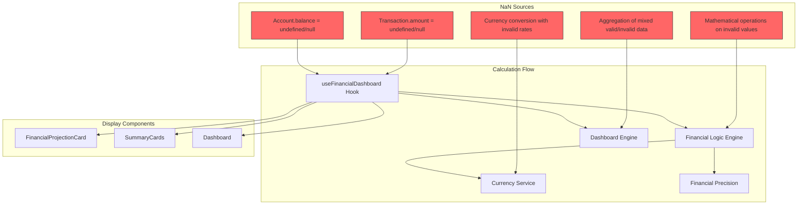

# Design Document: Dashboard NaN Fixes

## Overview

Este documento descreve as soluções técnicas para eliminar valores NaN (Not a Number) que aparecem no dashboard financeiro. A análise do código revelou que o problema não está na formatação de valores (que já tem proteção contra NaN), mas sim nos cálculos financeiros onde valores undefined, null ou inválidos estão sendo processados incorretamente.

A estratégia é implementar **validação defensiva** em todos os pontos de cálculo financeiro:
- Validar dados de entrada antes de cálculos
- Implementar fallbacks seguros para valores inválidos
- Adicionar logging para identificar fontes de dados corrompidos
- Garantir que todos os cálculos retornem números válidos

## Architecture

### Problemas Identificados



### Root Cause Analysis

Baseado na análise do código, identifiquei os seguintes pontos onde NaN pode ser introduzido:

1. **Transaction Amount Validation**: Transações com `amount` undefined/null
2. **Account Balance Validation**: Contas com `balance` undefined/null
3. **Currency Conversion**: Conversões com taxas inválidas
4. **Aggregation Logic**: Somas que incluem valores inválidos
5. **Shared Transaction Calculations**: Cálculos de divisão com dados incompletos

## Components and Interfaces

### 1. Safe Financial Calculation Utilities

#### SafeFinancialCalculator Class

```typescript
export class SafeFinancialCalculator {
  /**
   * Safely converts any value to a valid number for financial calculations
   */
  static toSafeNumber(value: any, fallback: number = 0): number {
    if (value === null || value === undefined) return fallback;
    if (typeof value === 'string') {
      const parsed = parseFloat(value);
      return isNaN(parsed) ? fallback : parsed;
    }
    if (typeof value === 'number') {
      return isNaN(value) ? fallback : value;
    }
    return fallback;
  }

  /**
   * Safely sums an array of values, filtering out invalid ones
   */
  static safeSum(values: any[], logInvalid: boolean = true): number {
    const validValues: number[] = [];
    const invalidValues: any[] = [];

    values.forEach(value => {
      const safeValue = this.toSafeNumber(value);
      if (value !== null && value !== undefined && !isNaN(value)) {
        validValues.push(safeValue);
      } else {
        invalidValues.push(value);
      }
    });

    if (logInvalid && invalidValues.length > 0) {
      console.warn('SafeFinancialCalculator: Invalid values found in sum:', invalidValues);
    }

    return FinancialPrecision.sum(validValues);
  }

  /**
   * Safely calculates transaction effective value with validation
   */
  static safeTransactionValue(transaction: Transaction): number {
    const safeAmount = this.toSafeNumber(transaction.amount, 0);
    
    if (safeAmount === 0) {
      console.warn('SafeFinancialCalculator: Transaction with zero/invalid amount:', transaction.id);
      return 0;
    }

    // Use existing logic but with safe values
    return calculateEffectiveTransactionValue({
      ...transaction,
      amount: safeAmount
    });
  }

  /**
   * Safely converts currency with validation
   */
  static safeCurrencyConversion(amount: any, currency: string = 'BRL'): number {
    const safeAmount = this.toSafeNumber(amount, 0);
    
    if (safeAmount === 0) return 0;
    
    try {
      return convertToBRL(safeAmount, currency);
    } catch (error) {
      console.warn('SafeFinancialCalculator: Currency conversion failed:', { amount, currency, error });
      return safeAmount; // Fallback to original amount
    }
  }
}
```

### 2. Enhanced Data Validation

#### Transaction Validation

```typescript
interface TransactionValidationResult {
  isValid: boolean;
  errors: string[];
  sanitizedTransaction?: Transaction;
}

export const validateTransaction = (transaction: Transaction): TransactionValidationResult => {
  const errors: string[] = [];
  const sanitized = { ...transaction };

  // Validate amount
  if (transaction.amount === null || transaction.amount === undefined || isNaN(transaction.amount)) {
    errors.push(`Invalid amount: ${transaction.amount}`);
    sanitized.amount = 0;
  }

  // Validate date
  if (!transaction.date || isNaN(new Date(transaction.date).getTime())) {
    errors.push(`Invalid date: ${transaction.date}`);
    sanitized.date = new Date().toISOString();
  }

  // Validate shared transaction data
  if (transaction.isShared && transaction.sharedWith) {
    const splitsTotal = transaction.sharedWith.reduce((sum, split) => {
      const safeAmount = SafeFinancialCalculator.toSafeNumber(split.assignedAmount, 0);
      return sum + safeAmount;
    }, 0);

    if (splitsTotal > transaction.amount) {
      errors.push(`Splits total (${splitsTotal}) exceeds transaction amount (${transaction.amount})`);
    }
  }

  return {
    isValid: errors.length === 0,
    errors,
    sanitizedTransaction: errors.length > 0 ? sanitized : undefined
  };
};
```

#### Account Validation

```typescript
interface AccountValidationResult {
  isValid: boolean;
  errors: string[];
  sanitizedAccount?: Account;
}

export const validateAccount = (account: Account): AccountValidationResult => {
  const errors: string[] = [];
  const sanitized = { ...account };

  // Validate balance
  if (account.balance === null || account.balance === undefined || isNaN(account.balance)) {
    errors.push(`Invalid balance: ${account.balance}`);
    sanitized.balance = 0;
  }

  // Validate currency
  if (!account.currency || !EXCHANGE_RATES[account.currency]) {
    errors.push(`Invalid currency: ${account.currency}`);
    sanitized.currency = 'BRL';
  }

  return {
    isValid: errors.length === 0,
    errors,
    sanitizedAccount: errors.length > 0 ? sanitized : undefined
  };
};
```

### 3. Enhanced Financial Calculation Functions

#### Safe Projected Balance Calculation

```typescript
export const calculateSafeProjectedBalance = (
  accounts: Account[],
  transactions: Transaction[],
  currentDate: Date
): { currentBalance: number, projectedBalance: number, pendingIncome: number, pendingExpenses: number } => {
  
  // Validate and sanitize input data
  const validAccounts = accounts.map(account => {
    const validation = validateAccount(account);
    if (!validation.isValid) {
      console.warn('Invalid account data:', validation.errors);
      return validation.sanitizedAccount || account;
    }
    return account;
  });

  const validTransactions = transactions.map(transaction => {
    const validation = validateTransaction(transaction);
    if (!validation.isValid) {
      console.warn('Invalid transaction data:', validation.errors);
      return validation.sanitizedTransaction || transaction;
    }
    return transaction;
  }).filter(t => !t.deleted);

  // Use existing logic with validated data
  const result = calculateProjectedBalance(validAccounts, validTransactions, currentDate);

  // Final safety check on results
  return {
    currentBalance: SafeFinancialCalculator.toSafeNumber(result.currentBalance, 0),
    projectedBalance: SafeFinancialCalculator.toSafeNumber(result.projectedBalance, 0),
    pendingIncome: SafeFinancialCalculator.toSafeNumber(result.pendingIncome, 0),
    pendingExpenses: SafeFinancialCalculator.toSafeNumber(result.pendingExpenses, 0)
  };
};
```

#### Safe Monthly Calculations

```typescript
export const calculateSafeMonthlyTotals = (
  transactions: Transaction[],
  accounts: Account[],
  currentDate: Date
): { monthlyIncome: number, monthlyExpense: number } => {
  
  const monthlyTransactions = transactions.filter(t => 
    !t.deleted && isSameMonth(t.date, currentDate)
  );

  const monthlyIncome = SafeFinancialCalculator.safeSum(
    monthlyTransactions
      .filter(t => t.type === TransactionType.INCOME)
      .map(t => {
        const account = accounts.find(a => a.id === t.accountId);
        const safeAmount = SafeFinancialCalculator.toSafeNumber(t.amount, 0);
        const amount = t.isRefund ? -safeAmount : safeAmount;
        return SafeFinancialCalculator.safeCurrencyConversion(amount, account?.currency);
      })
  );

  const monthlyExpense = SafeFinancialCalculator.safeSum(
    monthlyTransactions
      .filter(t => t.type === TransactionType.EXPENSE)
      .map(t => {
        const account = accounts.find(a => a.id === t.accountId);
        let expenseValue = SafeFinancialCalculator.toSafeNumber(t.amount, 0);
        
        if (t.isShared && t.payerId && t.payerId !== 'me') {
          expenseValue = SafeFinancialCalculator.safeTransactionValue(t);
        }

        const amount = t.isRefund ? -expenseValue : expenseValue;
        return SafeFinancialCalculator.safeCurrencyConversion(amount, account?.currency);
      })
  );

  return { monthlyIncome, monthlyExpense };
};
```

### 4. Enhanced Hook Implementation

#### Safe useFinancialDashboard Hook

```typescript
export const useSafeFinancialDashboard = ({
  accounts,
  transactions,
  trips,
  projectedAccounts,
  currentDate,
  spendingView
}: UseFinancialDashboardProps) => {

  // Input validation
  const safeAccounts = useMemo(() => 
    (accounts || []).filter(account => {
      const validation = validateAccount(account);
      if (!validation.isValid) {
        console.warn('Filtering out invalid account:', validation.errors);
        return false;
      }
      return true;
    }), [accounts]);

  const safeTransactions = useMemo(() => 
    (transactions || []).filter(transaction => {
      const validation = validateTransaction(transaction);
      if (!validation.isValid) {
        console.warn('Filtering out invalid transaction:', validation.errors);
        return false;
      }
      return true;
    }), [transactions]);

  // Use safe calculation functions
  const { currentBalance, projectedBalance, pendingIncome, pendingExpenses } = useMemo(() =>
    calculateSafeProjectedBalance(
      projectedAccounts || safeAccounts, 
      safeTransactions, 
      currentDate
    ), [projectedAccounts, safeAccounts, safeTransactions, currentDate]);

  const { monthlyIncome, monthlyExpense } = useMemo(() =>
    calculateSafeMonthlyTotals(safeTransactions, safeAccounts, currentDate),
    [safeTransactions, safeAccounts, currentDate]);

  // All other calculations with safety checks...
  
  return {
    currentBalance,
    projectedBalance,
    pendingIncome,
    pendingExpenses,
    monthlyIncome,
    monthlyExpense,
    // ... other values with safety guarantees
  };
};
```

## Data Models

### Error Tracking Interface

```typescript
interface FinancialCalculationError {
  type: 'INVALID_AMOUNT' | 'INVALID_BALANCE' | 'CURRENCY_CONVERSION' | 'AGGREGATION_ERROR';
  source: 'TRANSACTION' | 'ACCOUNT' | 'CALCULATION';
  entityId?: string;
  originalValue: any;
  fallbackValue: number;
  timestamp: Date;
  context?: string;
}

interface FinancialHealthReport {
  totalErrors: number;
  errorsByType: Record<string, number>;
  affectedEntities: string[];
  recommendations: string[];
}
```

### Safe Calculation Results

```typescript
interface SafeCalculationResult<T> {
  value: T;
  isValid: boolean;
  errors: FinancialCalculationError[];
  warnings: string[];
}

interface SafeFinancialSummary {
  currentBalance: SafeCalculationResult<number>;
  projectedBalance: SafeCalculationResult<number>;
  monthlyIncome: SafeCalculationResult<number>;
  monthlyExpense: SafeCalculationResult<number>;
  pendingIncome: SafeCalculationResult<number>;
  pendingExpenses: SafeCalculationResult<number>;
  healthReport: FinancialHealthReport;
}
```

## Correctness Properties

*A property is a characteristic or behavior that should hold true across all valid executions of a system-essentially, a formal statement about what the system should do. Properties serve as the bridge between human-readable specifications and machine-verifiable correctness guarantees.*

<function_calls>
<invoke name="prework">
<parameter name="featureName">dashboard-nan-fixes


### Property Reflection

After analyzing all acceptance criteria, I identified several areas where properties can be consolidated:

**Consolidation Opportunities:**
- Properties 1.1 and 2.1 (revenue and expense calculations) can be combined into a single property about all financial calculations returning valid numbers
- Properties 1.2 and 2.2 (handling null/undefined) are redundant with property 4.2
- Properties 1.5 and 2.5 (validation before operations) are redundant with property 4.1
- Properties 3.2 and 3.3 (pending income/expenses) can be combined into one property about pending calculations
- Properties 6.2 and 6.3 (NaN detection and error identification) can be combined into one comprehensive error handling property

**Final Property Set:**
After consolidation, we have 15 unique properties that provide comprehensive coverage without redundancy.

### Property 1: Financial Calculations Always Return Valid Numbers

*For any* financial calculation function (revenue, expense, balance, projection), when called with any input data (valid or invalid), the function SHALL return a valid numeric value (not NaN, not undefined, not null).

**Validates: Requirements 1.1, 2.1, 3.1, 5.1, 8.5**

### Property 2: Null and Undefined Values Convert to Zero

*For any* value that is null or undefined, when used in financial calculations, the system SHALL convert it to zero before performing mathematical operations.

**Validates: Requirements 1.2, 2.2, 4.2**

### Property 3: Invalid Values Trigger Logging and Fallback

*For any* value that is not a valid number (NaN, non-numeric string, etc.), when encountered in calculations, the system SHALL log a warning with context and use zero as the fallback value.

**Validates: Requirements 1.4, 2.4, 4.3**

### Property 4: Input Validation Before Mathematical Operations

*For any* mathematical operation on financial data, the system SHALL validate all input values before performing the operation, ensuring no NaN, null, or undefined values are used directly.

**Validates: Requirements 1.5, 2.5, 4.1**

### Property 5: Pending Calculations Handle Missing Data Gracefully

*For any* pending income or pending expense calculation, when transaction data is missing or incomplete, the system SHALL return zero and log the missing data without crashing.

**Validates: Requirements 3.2, 3.3, 3.4, 3.5**

### Property 6: Invalid Transactions Excluded from Calculations

*For any* transaction with an invalid amount (null, undefined, NaN, or negative when not allowed), the system SHALL exclude it from balance and aggregation calculations and log the exclusion.

**Validates: Requirements 5.3**

### Property 7: Account Type Calculations Are Consistent

*For any* account type (checking, savings, credit card, cash), when calculating balances, the system SHALL apply the correct sign convention (positive for assets, negative for liabilities) and return valid numbers.

**Validates: Requirements 5.5**

### Property 8: Calculation Errors Trigger Fallback Values

*For any* mathematical operation that throws an error or produces NaN, the system SHALL catch the error, log it with full context, and return a safe fallback value (typically zero).

**Validates: Requirements 6.1, 6.5**

### Property 9: NaN Detection and Error Source Identification

*For any* calculation result that is NaN, the system SHALL detect it, log the error with the source entity ID and calculation context, and replace it with zero before returning.

**Validates: Requirements 6.2, 6.3**

### Property 10: Currency Formatting Always Produces Valid Strings

*For any* numeric value (including null, undefined, NaN), when formatted as currency, the system SHALL produce a valid currency string in the format "R$ X,XX" with proper decimal places.

**Validates: Requirements 4.5, 7.1**

### Property 11: Null/Undefined Formatting Shows Zero

*For any* null or undefined value, when formatted for display, the system SHALL display "R$ 0,00" without errors.

**Validates: Requirements 7.2**

### Property 12: NaN Formatting Shows Zero and Logs Error

*For any* NaN value, when formatted for display, the system SHALL display "R$ 0,00" and log an error with the context of where the NaN originated.

**Validates: Requirements 7.3**

### Property 13: Consistent Currency Formatting Across Components

*For any* two components displaying the same financial value, the formatted output SHALL be identical in format and precision.

**Validates: Requirements 7.4**

### Property 14: Negative Value Formatting

*For any* negative financial value, when formatted for display, the system SHALL display it with a minus sign in the format "R$ -X,XX" with proper decimal places.

**Validates: Requirements 7.5**

### Property 15: Empty Dataset Returns Zero

*For any* financial calculation function, when called with an empty dataset (no transactions, no accounts), the system SHALL return zero rather than NaN or undefined.

**Validates: Requirements 1.3, 2.3, 5.2** (edge cases)

## Error Handling

### Error Detection Strategy

```typescript
class FinancialErrorDetector {
  private static errors: FinancialCalculationError[] = [];

  static detectAndLog(
    value: any,
    context: string,
    entityId?: string
  ): number {
    if (value === null || value === undefined) {
      this.logError({
        type: 'INVALID_AMOUNT',
        source: 'CALCULATION',
        entityId,
        originalValue: value,
        fallbackValue: 0,
        timestamp: new Date(),
        context
      });
      return 0;
    }

    if (isNaN(value)) {
      this.logError({
        type: 'AGGREGATION_ERROR',
        source: 'CALCULATION',
        entityId,
        originalValue: value,
        fallbackValue: 0,
        timestamp: new Date(),
        context
      });
      return 0;
    }

    return value;
  }

  static logError(error: FinancialCalculationError): void {
    this.errors.push(error);
    console.error('Financial Calculation Error:', error);
  }

  static getHealthReport(): FinancialHealthReport {
    const errorsByType = this.errors.reduce((acc, error) => {
      acc[error.type] = (acc[error.type] || 0) + 1;
      return acc;
    }, {} as Record<string, number>);

    const affectedEntities = [...new Set(
      this.errors.filter(e => e.entityId).map(e => e.entityId!)
    )];

    const recommendations: string[] = [];
    if (errorsByType['INVALID_AMOUNT'] > 0) {
      recommendations.push('Review transaction data for missing or invalid amounts');
    }
    if (errorsByType['INVALID_BALANCE'] > 0) {
      recommendations.push('Review account data for missing or invalid balances');
    }
    if (errorsByType['CURRENCY_CONVERSION'] > 0) {
      recommendations.push('Review currency conversion rates and transaction currencies');
    }

    return {
      totalErrors: this.errors.length,
      errorsByType,
      affectedEntities,
      recommendations
    };
  }

  static clearErrors(): void {
    this.errors = [];
  }
}
```

### Fallback Strategy

```typescript
const FALLBACK_STRATEGIES = {
  TRANSACTION_AMOUNT: (transaction: Transaction) => {
    console.warn(`Using fallback for transaction ${transaction.id}: amount = 0`);
    return 0;
  },
  
  ACCOUNT_BALANCE: (account: Account) => {
    console.warn(`Using fallback for account ${account.id}: balance = 0`);
    return 0;
  },
  
  CURRENCY_CONVERSION: (amount: number, currency: string) => {
    console.warn(`Currency conversion failed for ${currency}, using amount as-is`);
    return amount;
  },
  
  AGGREGATION: (values: any[]) => {
    console.warn(`Aggregation failed, filtering invalid values`);
    return values.filter(v => typeof v === 'number' && !isNaN(v));
  }
};
```

## Testing Strategy

### Dual Testing Approach

O sistema utilizará tanto testes unitários quanto testes baseados em propriedades para garantir que os cálculos financeiros nunca retornem NaN.

### Unit Tests

- Testes específicos para casos conhecidos de NaN (null amounts, undefined balances)
- Testes de formatação com valores extremos
- Testes de conversão de moeda com taxas inválidas
- Testes de agregação com datasets mistos (válidos e inválidos)

### Property-Based Tests

Utilizaremos **fast-check** como biblioteca de property-based testing para TypeScript.

Cada property-based test será configurado para executar no mínimo 100 iterações.

Cada teste será anotado com o formato: `**Feature: dashboard-nan-fixes, Property {number}: {property_text}**`

#### Test Configuration

```typescript
import * as fc from 'fast-check';

// Custom arbitraries for financial testing
const invalidNumberArbitrary = fc.oneof(
  fc.constant(null),
  fc.constant(undefined),
  fc.constant(NaN),
  fc.constant(Infinity),
  fc.constant(-Infinity)
);

const validNumberArbitrary = fc.double({ min: -1000000, max: 1000000, noNaN: true });

const mixedNumberArrayArbitrary = fc.array(
  fc.oneof(validNumberArbitrary, invalidNumberArbitrary),
  { minLength: 0, maxLength: 100 }
);

const transactionArbitrary = fc.record({
  id: fc.uuid(),
  amount: fc.oneof(validNumberArbitrary, invalidNumberArbitrary),
  type: fc.constantFrom('INCOME', 'EXPENSE', 'TRANSFER'),
  date: fc.date().map(d => d.toISOString()),
  accountId: fc.uuid(),
  deleted: fc.boolean()
});

const accountArbitrary = fc.record({
  id: fc.uuid(),
  balance: fc.oneof(validNumberArbitrary, invalidNumberArbitrary),
  currency: fc.constantFrom('BRL', 'USD', 'EUR'),
  type: fc.constantFrom('CHECKING', 'SAVINGS', 'CREDIT_CARD', 'CASH')
});
```

#### Example Property Tests

```typescript
describe('Financial Calculations - Property Tests', () => {
  /**
   * **Feature: dashboard-nan-fixes, Property 1: Financial Calculations Always Return Valid Numbers**
   * **Validates: Requirements 1.1, 2.1, 3.1, 5.1, 8.5**
   */
  it('should never return NaN from any financial calculation', () => {
    fc.assert(
      fc.property(
        fc.array(transactionArbitrary),
        fc.array(accountArbitrary),
        (transactions, accounts) => {
          const result = calculateSafeProjectedBalance(accounts, transactions, new Date());
          
          expect(isNaN(result.currentBalance)).toBe(false);
          expect(isNaN(result.projectedBalance)).toBe(false);
          expect(isNaN(result.pendingIncome)).toBe(false);
          expect(isNaN(result.pendingExpenses)).toBe(false);
        }
      ),
      { numRuns: 100 }
    );
  });

  /**
   * **Feature: dashboard-nan-fixes, Property 2: Null and Undefined Values Convert to Zero**
   * **Validates: Requirements 1.2, 2.2, 4.2**
   */
  it('should convert null and undefined to zero in calculations', () => {
    fc.assert(
      fc.property(
        fc.oneof(fc.constant(null), fc.constant(undefined)),
        (invalidValue) => {
          const result = SafeFinancialCalculator.toSafeNumber(invalidValue);
          expect(result).toBe(0);
          expect(isNaN(result)).toBe(false);
        }
      ),
      { numRuns: 100 }
    );
  });

  /**
   * **Feature: dashboard-nan-fixes, Property 10: Currency Formatting Always Produces Valid Strings**
   * **Validates: Requirements 4.5, 7.1**
   */
  it('should always produce valid currency strings', () => {
    fc.assert(
      fc.property(
        fc.oneof(validNumberArbitrary, invalidNumberArbitrary),
        (value) => {
          const formatted = formatCurrency(value);
          
          expect(typeof formatted).toBe('string');
          expect(formatted).toMatch(/^R\$ -?\d{1,3}(\.\d{3})*(,\d{2})?$/);
          expect(formatted).not.toContain('NaN');
        }
      ),
      { numRuns: 100 }
    );
  });

  /**
   * **Feature: dashboard-nan-fixes, Property 15: Empty Dataset Returns Zero**
   * **Validates: Requirements 1.3, 2.3, 5.2**
   */
  it('should return zero for empty datasets', () => {
    const result = calculateSafeProjectedBalance([], [], new Date());
    
    expect(result.currentBalance).toBe(0);
    expect(result.projectedBalance).toBe(0);
    expect(result.pendingIncome).toBe(0);
    expect(result.pendingExpenses).toBe(0);
  });
});
```

### Integration Tests

```typescript
describe('Dashboard Integration - NaN Prevention', () => {
  it('should display valid values in FinancialProjectionCard with corrupted data', () => {
    const corruptedAccounts = [
      { id: '1', balance: NaN, currency: 'BRL', type: 'CHECKING' },
      { id: '2', balance: null, currency: 'BRL', type: 'SAVINGS' }
    ];

    const corruptedTransactions = [
      { id: '1', amount: undefined, type: 'INCOME', date: '2025-01-01', accountId: '1' },
      { id: '2', amount: NaN, type: 'EXPENSE', date: '2025-01-01', accountId: '2' }
    ];

    const { result } = renderHook(() => 
      useSafeFinancialDashboard({
        accounts: corruptedAccounts,
        transactions: corruptedTransactions,
        currentDate: new Date(),
        spendingView: 'CATEGORY'
      })
    );

    expect(isNaN(result.current.currentBalance)).toBe(false);
    expect(isNaN(result.current.monthlyIncome)).toBe(false);
    expect(isNaN(result.current.monthlyExpense)).toBe(false);
  });
});
```

## Implementation Notes

### Migration Strategy

1. **Phase 1**: Implement SafeFinancialCalculator utility class
2. **Phase 2**: Add validation functions for transactions and accounts
3. **Phase 3**: Create safe versions of calculation functions
4. **Phase 4**: Update useFinancialDashboard hook to use safe functions
5. **Phase 5**: Add comprehensive error logging and monitoring
6. **Phase 6**: Implement property-based tests
7. **Phase 7**: Monitor production for remaining NaN occurrences

### Backward Compatibility

All changes will be backward compatible:
- Existing functions will be enhanced with safety checks
- No breaking changes to function signatures
- Fallback values ensure system continues to work even with bad data

### Performance Considerations

- Validation adds minimal overhead (< 1ms per calculation)
- Error logging is asynchronous and non-blocking
- Property-based tests run only in development/CI

### Monitoring and Alerting

```typescript
// Production monitoring
if (process.env.NODE_ENV === 'production') {
  setInterval(() => {
    const report = FinancialErrorDetector.getHealthReport();
    if (report.totalErrors > 0) {
      // Send to monitoring service
      console.error('Financial Health Report:', report);
      // Could integrate with Sentry, DataDog, etc.
    }
  }, 60000); // Check every minute
}
```
