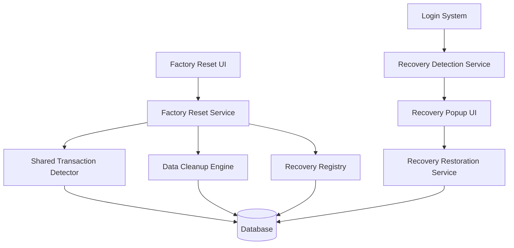

# Design Document: Factory Reset com Recuperação Inteligente

## Overview

O sistema de Factory Reset com Recuperação Inteligente permite que usuários façam uma limpeza completa de seus dados pessoais, mas preserva a capacidade de recuperar transações compartilhadas que ainda existem em outros usuários. O sistema funciona em três fases: detecção e preservação, execução do reset, e recuperação inteligente no retorno do usuário.

## Architecture

### Componentes Principais



### Fluxo de Dados

1. **Fase de Detecção**: Identifica transações compartilhadas antes do reset
2. **Fase de Preservação**: Cria registros de recuperação para dados compartilhados
3. **Fase de Limpeza**: Remove todos os dados pessoais do usuário
4. **Fase de Recuperação**: Detecta e oferece restauração no próximo login

## Components and Interfaces

### 1. Factory Reset Service

```typescript
interface FactoryResetService {
  // Inicia o processo de factory reset
  initiateReset(userId: string): Promise<ResetSummary>
  
  // Executa o factory reset completo
  executeReset(userId: string, confirmation: ResetConfirmation): Promise<void>
  
  // Obtém resumo do que será apagado
  getResetSummary(userId: string): Promise<ResetSummary>
}

interface ResetSummary {
  personalTransactions: number
  accounts: number
  investments: number
  budgetsAndGoals: number
  sharedTransactions: SharedTransactionSummary[]
  recoverableItems: number
}

interface SharedTransactionSummary {
  id: string
  type: 'trip' | 'shared_expense'
  amount: number
  date: string
  originalOwner: string
  canRecover: boolean
}
```

### 2. Shared Transaction Detector

```typescript
interface SharedTransactionDetector {
  // Detecta todas as transações compartilhadas do usuário
  detectSharedTransactions(userId: string): Promise<SharedTransaction[]>
  
  // Verifica se uma transação compartilhada ainda é válida
  validateSharedTransaction(transactionId: string): Promise<boolean>
  
  // Identifica o proprietário original da transação
  getOriginalOwner(transactionId: string): Promise<string>
}

interface SharedTransaction {
  id: string
  type: 'trip' | 'shared_expense'
  originalOwnerId: string
  metadata: TransactionMetadata
  isValid: boolean
}
```

### 3. Recovery Registry

```typescript
interface RecoveryRegistry {
  // Cria registros de recuperação para transações compartilhadas
  createRecoveryRecords(userId: string, transactions: SharedTransaction[]): Promise<void>
  
  // Obtém registros de recuperação disponíveis
  getRecoveryRecords(userId: string): Promise<RecoveryRecord[]>
  
  // Remove registros de recuperação
  clearRecoveryRecords(userId: string, recordIds?: string[]): Promise<void>
}

interface RecoveryRecord {
  id: string
  userId: string
  originalTransactionId: string
  transactionType: string
  metadata: TransactionMetadata
  createdAt: string
  isValid: boolean
}
```

### 4. Data Cleanup Engine

```typescript
interface DataCleanupEngine {
  // Remove todos os dados pessoais do usuário
  cleanupUserData(userId: string): Promise<CleanupResult>
  
  // Remove dados específicos por categoria
  cleanupTransactions(userId: string): Promise<void>
  cleanupAccounts(userId: string): Promise<void>
  cleanupInvestments(userId: string): Promise<void>
  cleanupBudgetsAndGoals(userId: string): Promise<void>
  cleanupSettings(userId: string): Promise<void>
}

interface CleanupResult {
  transactionsRemoved: number
  accountsRemoved: number
  investmentsRemoved: number
  budgetsRemoved: number
  settingsReset: boolean
  errors: string[]
}
```

### 5. Recovery Detection Service

```typescript
interface RecoveryDetectionService {
  // Verifica se há dados recuperáveis no login
  checkRecoverableData(userId: string): Promise<RecoveryAvailability>
  
  // Valida registros de recuperação antes de exibir
  validateRecoveryRecords(records: RecoveryRecord[]): Promise<RecoveryRecord[]>
}

interface RecoveryAvailability {
  hasRecoverableData: boolean
  recordCount: number
  records: RecoveryRecord[]
}
```

### 6. Recovery Restoration Service

```typescript
interface RecoveryRestorationService {
  // Restaura transações selecionadas
  restoreTransactions(userId: string, recordIds: string[]): Promise<RestorationResult>
  
  // Valida se uma transação pode ser restaurada
  canRestore(recordId: string): Promise<boolean>
}

interface RestorationResult {
  restored: number
  failed: number
  errors: string[]
}
```

## Data Models

### Recovery Records Table

```sql
CREATE TABLE recovery_records (
  id UUID PRIMARY KEY DEFAULT gen_random_uuid(),
  user_id UUID NOT NULL REFERENCES auth.users(id),
  original_transaction_id UUID NOT NULL,
  transaction_type VARCHAR(50) NOT NULL,
  metadata JSONB NOT NULL,
  created_at TIMESTAMP WITH TIME ZONE DEFAULT NOW(),
  is_valid BOOLEAN DEFAULT true,
  
  INDEX idx_recovery_user_id (user_id),
  INDEX idx_recovery_transaction_id (original_transaction_id)
);
```

### Factory Reset Audit Table

```sql
CREATE TABLE factory_reset_audit (
  id UUID PRIMARY KEY DEFAULT gen_random_uuid(),
  user_id UUID NOT NULL REFERENCES auth.users(id),
  action VARCHAR(50) NOT NULL, -- 'initiated', 'completed', 'recovery_created', 'recovery_restored'
  details JSONB,
  created_at TIMESTAMP WITH TIME ZONE DEFAULT NOW(),
  
  INDEX idx_audit_user_id (user_id),
  INDEX idx_audit_action (action)
);
```

## Correctness Properties

*A property is a characteristic or behavior that should hold true across all valid executions of a system-essentially, a formal statement about what the system should do. Properties serve as the bridge between human-readable specifications and machine-verifiable correctness guarantees.*

<function_calls>
<invoke name="prework">
<parameter name="featureName">factory-reset-recovery

### Property Reflection

Após análise das propriedades identificadas no prework, identifiquei algumas redundâncias que podem ser consolidadas:

- Propriedades 1.1-1.5 (limpeza de diferentes tipos de dados) podem ser combinadas em uma propriedade mais abrangente sobre limpeza completa
- Propriedades 3.1-3.3 (criação de registros de recuperação) podem ser combinadas em uma propriedade sobre integridade dos registros
- Propriedades 5.1-5.2 (validações de recuperação) podem ser combinadas em uma propriedade sobre validação completa
- Propriedades 7.1-7.5 (logs de auditoria) podem ser combinadas em uma propriedade sobre auditoria completa

### Correctness Properties

**Property 1: Complete Data Cleanup**
*For any* user with personal data (transactions, accounts, investments, budgets, settings), executing factory reset should remove all personal data while preserving only authentication credentials
**Validates: Requirements 1.1, 1.2, 1.3, 1.4, 1.5, 1.6**

**Property 2: Shared Transaction Detection**
*For any* user with shared transactions, the recovery system should identify all shared transactions and verify their validity with original owners
**Validates: Requirements 2.1, 2.2**

**Property 3: Recovery Record Integrity**
*For any* valid shared transaction, creating a recovery record should store the original transaction ID, original owner ID, and complete metadata accurately
**Validates: Requirements 3.1, 3.2, 3.3**

**Property 4: Recovery Record Isolation**
*For any* completed factory reset, only recovery records should remain for the user, with all other data removed
**Validates: Requirements 3.4**

**Property 5: Recovery Detection on Login**
*For any* user who previously had factory reset with recoverable data, login should detect and present available recovery options
**Validates: Requirements 4.1, 4.2, 4.3**

**Property 6: Recovery Restoration**
*For any* selected recovery records, restoration should successfully recreate the shared transactions if they are still valid
**Validates: Requirements 4.4**

**Property 7: Recovery Cleanup**
*For any* recovery records not selected for restoration, they should be permanently deleted from the system
**Validates: Requirements 4.5**

**Property 8: Recovery Validation**
*For any* recovery request, the system should validate that original transactions still exist and original owners still have access before proceeding
**Validates: Requirements 5.1, 5.2, 5.3, 5.4, 5.5**

**Property 9: Reset Confirmation Flow**
*For any* factory reset request, the system should display complete summary, require explicit confirmation, and only proceed when confirmed
**Validates: Requirements 6.1, 6.2, 6.3, 6.4, 6.5**

**Property 10: Complete Audit Trail**
*For any* factory reset or recovery operation, the system should create comprehensive audit logs with timestamps, user IDs, and operation details
**Validates: Requirements 7.1, 7.2, 7.3, 7.4, 7.5**

## Error Handling

### Factory Reset Errors

1. **Partial Cleanup Failure**: Se alguma categoria de dados falhar na limpeza, o sistema deve reverter todas as alterações e reportar o erro
2. **Shared Transaction Detection Failure**: Se a detecção falhar, o sistema deve alertar o usuário e permitir prosseguir apenas com confirmação explícita
3. **Recovery Record Creation Failure**: Se a criação de registros falhar, o sistema deve abortar o reset e manter os dados originais

### Recovery Errors

1. **Invalid Recovery Records**: Registros que não podem ser validados devem ser automaticamente removidos
2. **Restoration Failure**: Se a restauração falhar parcialmente, o sistema deve reportar quais itens falharam e manter os registros para nova tentativa
3. **Original Transaction Missing**: Se a transação original não existir mais, o registro deve ser removido silenciosamente

### Database Consistency

1. **Transaction Rollback**: Todas as operações devem ser executadas em transações que podem ser revertidas em caso de erro
2. **Referential Integrity**: O sistema deve verificar integridade referencial antes de executar limpezas
3. **Concurrent Access**: O sistema deve lidar com tentativas simultâneas de factory reset do mesmo usuário

## Testing Strategy

### Unit Tests

- Testar cada componente isoladamente com dados mockados
- Verificar cenários de erro e edge cases específicos
- Testar validações de entrada e saída de cada função
- Verificar comportamento correto em casos de falha de dependências

### Property-Based Tests

- Usar biblioteca de property testing (como fast-check para TypeScript)
- Configurar mínimo de 100 iterações por teste de propriedade
- Gerar dados aleatórios para usuários, transações e cenários diversos
- Cada teste deve referenciar sua propriedade do documento de design
- Tag format: **Feature: factory-reset-recovery, Property {number}: {property_text}**

### Integration Tests

- Testar fluxo completo de factory reset com dados reais
- Verificar integração entre componentes do sistema
- Testar cenários de recuperação end-to-end
- Validar comportamento do sistema em ambiente próximo à produção

### Database Tests

- Verificar integridade dos dados após operações
- Testar performance com grandes volumes de dados
- Validar comportamento de transações e rollbacks
- Testar cenários de concorrência e locks