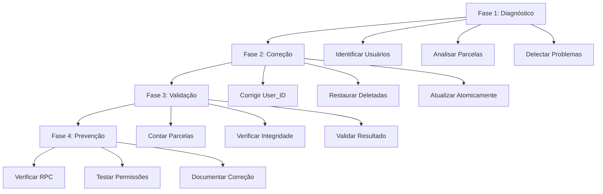

# Design Document

## Overview

Este documento descreve o design da solução para corrigir o bug onde parcelas importadas aparecem em quantidades diferentes para usuários diferentes. A solução implementa um sistema de diagnóstico, correção e validação para garantir que todas as parcelas sejam visíveis para o usuário correto.

## Architecture

A solução segue uma arquitetura de 4 fases:



## Components and Interfaces

### 1. Diagnostic Engine

**Responsabilidade**: Identificar e analisar problemas nas parcelas importadas.

```sql
-- Interface principal
FUNCTION diagnose_missing_installments(
    p_description_pattern TEXT DEFAULT '%Wesley%'
) RETURNS TABLE (
    phase TEXT,
    status TEXT,
    message TEXT,
    details JSONB
);
```

**Componentes**:
- **User Identifier**: Identifica usuários A e B
- **Installment Analyzer**: Analisa cada parcela individualmente
- **Problem Detector**: Detecta user_id incorreto, parcelas deletadas, contas diferentes

### 2. Correction Engine

**Responsabilidade**: Corrigir problemas identificados no diagnóstico.

```sql
-- Interface principal
FUNCTION fix_missing_installments(
    p_description_pattern TEXT DEFAULT '%Wesley%',
    p_dry_run BOOLEAN DEFAULT true
) RETURNS TABLE (
    action TEXT,
    installment_id UUID,
    old_user_id UUID,
    new_user_id UUID,
    success BOOLEAN,
    message TEXT
);
```

**Componentes**:
- **User_ID Corrector**: Atualiza user_id para o dono da conta
- **Deletion Restorer**: Restaura parcelas incorretamente deletadas
- **Atomic Updater**: Executa todas as correções em uma transação

### 3. Validation Engine

**Responsabilidade**: Validar que as correções foram aplicadas corretamente.

```sql
-- Interface principal
FUNCTION validate_installment_fix(
    p_description_pattern TEXT DEFAULT '%Wesley%'
) RETURNS TABLE (
    check_name TEXT,
    expected_value TEXT,
    actual_value TEXT,
    status TEXT,
    details TEXT
);
```

**Componentes**:
- **Count Validator**: Verifica quantidade total de parcelas
- **Integrity Checker**: Verifica consistência dos dados
- **Visibility Tester**: Testa visibilidade para usuário correto

### 4. Prevention System

**Responsabilidade**: Garantir que o problema não ocorra novamente.

```sql
-- Interface de verificação
FUNCTION verify_prevention_measures() RETURNS TABLE (
    component TEXT,
    status TEXT,
    message TEXT,
    recommendation TEXT
);
```

**Componentes**:
- **RPC Validator**: Verifica se create_transaction está correto
- **Permission Checker**: Verifica função can_access_account
- **Test Runner**: Executa testes de regressão

## Data Models

### Installment Analysis Model

```sql
TYPE installment_analysis AS (
    id UUID,
    description TEXT,
    current_installment INTEGER,
    total_installments INTEGER,
    amount DECIMAL,
    date DATE,
    type TEXT,
    category TEXT,
    user_id UUID,
    account_id UUID,
    deleted BOOLEAN,
    created_at TIMESTAMP,
    updated_at TIMESTAMP,
    -- Campos de análise
    user_status TEXT,        -- '✅ CORRETO' ou '❌ ERRADO'
    delete_status TEXT,      -- '✅ ATIVO' ou '❌ DELETADO'
    account_status TEXT,     -- '✅ CONTA CORRETA' ou '❌ CONTA ERRADA'
    visibility_status TEXT   -- '🟢 VISÍVEL' ou '🔴 NÃO VISÍVEL'
);
```

### Correction Action Model

```sql
TYPE correction_action AS (
    action_type TEXT,        -- 'UPDATE_USER_ID', 'RESTORE_DELETED', 'NO_ACTION'
    installment_id UUID,
    current_user_id UUID,
    target_user_id UUID,
    current_deleted BOOLEAN,
    target_deleted BOOLEAN,
    reason TEXT,
    priority INTEGER         -- 1=Alta, 2=Média, 3=Baixa
);
```

### Validation Result Model

```sql
TYPE validation_result AS (
    check_name TEXT,
    expected_value TEXT,
    actual_value TEXT,
    status TEXT,             -- 'PASS', 'FAIL', 'WARNING'
    severity TEXT,           -- 'CRITICAL', 'HIGH', 'MEDIUM', 'LOW'
    details TEXT,
    recommendation TEXT
);
```

## Correctness Properties

*A property is a characteristic or behavior that should hold true across all valid executions of a system-essentially, a formal statement about what the system should do. Properties serve as the bridge between human-readable specifications and machine-verifiable correctness guarantees.*

### Property 1: Complete Installment Discovery
*For any* set of installments matching a description pattern, the diagnostic system should identify all and only those installments that match the pattern
**Validates: Requirements 1.1**

### Property 2: Comprehensive Analysis Coverage
*For any* installment analyzed by the system, the analysis result should include user_id, account_id, and deleted status information
**Validates: Requirements 1.2**

### Property 3: Problem Detection Completeness
*For any* set of installments with incorrect user_id or deleted status, the diagnostic system should identify all problematic installments
**Validates: Requirements 1.3, 1.4**

### Property 4: User_ID Correction Accuracy
*For any* installment with incorrect user_id, after correction the installment should have the user_id of the account owner
**Validates: Requirements 2.1**

### Property 5: Data Preservation During Correction
*For any* installment being corrected, all fields except user_id and deleted should remain unchanged after the correction operation
**Validates: Requirements 2.2**

### Property 6: Atomic Correction Operations
*For any* batch of installments being corrected, either all corrections succeed or none do (atomicity property)
**Validates: Requirements 2.3**

### Property 7: Account Validation Before Correction
*For any* correction attempt, the system should reject corrections targeting non-existent or deleted accounts
**Validates: Requirements 2.4**

### Property 8: Deletion Restoration Accuracy
*For any* installment incorrectly marked as deleted, after restoration the installment should have deleted=false and correct user_id
**Validates: Requirements 3.1, 3.2**

### Property 9: Post-Correction Visibility Consistency
*For any* corrected set of installments, all installments should be visible to the account owner and have consistent user_id
**Validates: Requirements 4.1, 4.3**

### Property 10: Installment Count Accuracy
*For any* corrected installment group, the total count should match the expected number of installments
**Validates: Requirements 4.2**

### Property 11: No Deleted Installments After Correction
*For any* corrected installment group, no installment should have deleted=true after successful correction
**Validates: Requirements 4.4**

### Property 12: Account Consistency
*For any* corrected installment group, all installments should belong to the same account
**Validates: Requirements 4.5**

### Property 13: Security Validation
*For any* attempt to create transactions in accounts without permission, the system should reject the operation
**Validates: Requirements 5.4**

## Error Handling

### Error Categories

1. **Data Integrity Errors**
   - Missing or corrupted installment data
   - Inconsistent user_id or account_id references
   - Invalid foreign key relationships

2. **Permission Errors**
   - Unauthorized access to accounts
   - Missing authentication context
   - Invalid user permissions

3. **Business Logic Errors**
   - Installment count mismatches
   - Invalid installment sequences
   - Inconsistent financial data

4. **System Errors**
   - Database connection failures
   - Transaction rollback scenarios
   - Concurrent modification conflicts

### Error Recovery Strategies

```sql
-- Exemplo de tratamento de erro com rollback
BEGIN;
    -- Tentativa de correção
    PERFORM fix_installment_user_id(installment_id, new_user_id);
EXCEPTION
    WHEN foreign_key_violation THEN
        ROLLBACK;
        RAISE EXCEPTION 'Conta de destino não existe: %', new_user_id;
    WHEN check_violation THEN
        ROLLBACK;
        RAISE EXCEPTION 'Dados inválidos para correção: %', SQLERRM;
    WHEN OTHERS THEN
        ROLLBACK;
        RAISE EXCEPTION 'Erro inesperado durante correção: %', SQLERRM;
END;
```

## Testing Strategy

### Dual Testing Approach

A estratégia de testes combina testes unitários e testes baseados em propriedades:

**Unit Tests**: Verificam exemplos específicos, casos extremos e condições de erro
- Teste de diagnóstico com dados conhecidos
- Teste de correção de parcela específica
- Teste de validação com cenários controlados
- Teste de tratamento de erros

**Property Tests**: Verificam propriedades universais através de muitas entradas
- Propriedades de descoberta completa de parcelas
- Propriedades de preservação de dados durante correção
- Propriedades de atomicidade e consistência
- Propriedades de validação de segurança

### Property-Based Testing Configuration

- **Framework**: pgTAP para PostgreSQL
- **Iterations**: Mínimo 100 iterações por teste de propriedade
- **Tag Format**: **Feature: missing-installment-fix, Property {number}: {property_text}**
- Cada propriedade de correção deve ser implementada por um ÚNICO teste baseado em propriedade
- Cada teste deve referenciar sua propriedade do documento de design

### Test Data Generation

```sql
-- Gerador de dados de teste para parcelas
FUNCTION generate_test_installments(
    p_count INTEGER,
    p_user_a_id UUID,
    p_user_b_id UUID,
    p_account_id UUID,
    p_corruption_rate DECIMAL DEFAULT 0.3
) RETURNS UUID[];
```

**Estratégias de Geração**:
- Parcelas com user_id correto e incorreto
- Parcelas deletadas e não deletadas
- Diferentes contas e usuários
- Sequências de parcelas completas e incompletas
