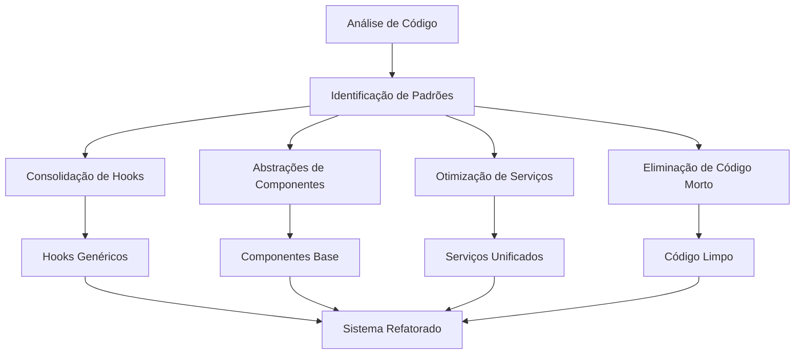

# Design Document

## Overview

Este documento detalha a estratégia de refatoração conservadora do sistema financeiro, visando reduzir 25-40% do código (11.000-18.000 linhas) mantendo 100% das funcionalidades existentes. A refatoração focará em consolidação de padrões repetitivos, abstrações genéricas e eliminação de código redundante.

**Análise Atual:**
- **Total de linhas:** 45.927 linhas TypeScript/React
- **Arquivos maiores:** useDataStore.ts (821), supabaseService.ts (726), TransactionForm.tsx (717)
- **Padrões identificados:** 227 arquivos com interfaces Props repetitivas, hooks com lógica similar, componentes com estruturas duplicadas

## Architecture

### Estratégia de Refatoração em Camadas



### Princípios da Refatoração

1. **Preservação Total:** Zero alterações em funcionalidades, layouts ou comportamentos
2. **Consolidação Inteligente:** Identificar e mesclar código similar mantendo especificidades
3. **Abstrações Genéricas:** Criar componentes base reutilizáveis sem perder flexibilidade
4. **Eliminação Segura:** Remover apenas código comprovadamente não utilizado

## Components and Interfaces

### 1. Consolidação de Hooks

#### Hook Genérico de Formulário
```typescript
// Substitui múltiplos hooks similares (useTransactionForm, useTripForm, etc.)
interface GenericFormConfig<T> {
  initialData?: T;
  validationRules: ValidationRule<T>[];
  onSubmit: (data: T) => Promise<void>;
  transformers?: FormTransformers<T>;
}

const useGenericForm = <T>(config: GenericFormConfig<T>) => {
  // Lógica consolidada de formulários
  // Reduz ~300 linhas duplicadas entre hooks
}
```

#### Hook Unificado de Estado Modal
```typescript
// Consolida useState repetitivos para modais
interface ModalState {
  [key: string]: {
    isOpen: boolean;
    data?: any;
  };
}

const useModalManager = (initialModals: string[]) => {
  // Gerencia todos os modais de um componente
  // Reduz ~150 linhas de useState repetitivos
}
```

### 2. Abstrações de Componentes

#### Componente Base de Formulário
```typescript
interface BaseFormProps<T> {
  fields: FormFieldConfig[];
  initialData?: T;
  onSubmit: (data: T) => void;
  validation?: ValidationSchema<T>;
  layout?: 'vertical' | 'horizontal' | 'grid';
}

// Substitui estruturas repetitivas em TransactionForm, TripForm, etc.
// Reduz ~400 linhas de JSX duplicado
```

#### Sistema de Props Genéricas
```typescript
// Consolida interfaces Props similares
interface BaseEntityProps<T> {
  data: T[];
  onAdd?: (item: T) => void;
  onEdit?: (item: T) => void;
  onDelete?: (id: string) => void;
  loading?: boolean;
}

// Reduz ~50 interfaces Props repetitivas
```

### 3. Otimização de Serviços

#### Mapper Genérico
```typescript
// Substitui múltiplos mappers específicos
class GenericMapper {
  static toApp<T>(data: unknown, schema: MappingSchema): T;
  static toDB<T>(data: T, schema: MappingSchema): Record<string, unknown>;
}

// Reduz ~200 linhas de código de mapeamento
```

#### Serviço CRUD Genérico
```typescript
// Consolida operações CRUD repetitivas
class GenericCRUDService<T> {
  constructor(private tableName: string, private mapper: MappingSchema) {}
  
  async getAll(): Promise<T[]>;
  async getById(id: string): Promise<T>;
  async create(data: Omit<T, 'id'>): Promise<T>;
  async update(id: string, data: Partial<T>): Promise<T>;
  async delete(id: string): Promise<void>;
}

// Reduz ~300 linhas de métodos CRUD duplicados
```

## Data Models

### Consolidação de Tipos

#### Tipos Base Genéricos
```typescript
// Substitui definições repetitivas
interface BaseEntity {
  id: string;
  createdAt: string;
  updatedAt: string;
  userId?: string;
}

interface BaseFormData<T> {
  data: T;
  errors: Record<keyof T, string>;
  isSubmitting: boolean;
  isDirty: boolean;
}

// Reduz ~100 linhas de definições de tipos
```

#### Schema de Validação Unificado
```typescript
// Consolida regras de validação espalhadas
interface ValidationSchema<T> {
  [K in keyof T]?: ValidationRule[];
}

// Centraliza ~150 linhas de validações duplicadas
```

## Correctness Properties

*A property is a characteristic or behavior that should hold true across all valid executions of a system-essentially, a formal statement about what the system should do. Properties serve as the bridge between human-readable specifications and machine-verifiable correctness guarantees.*

### Property 1: Pattern Detection Accuracy
*For any* codebase analysis, all repetitive patterns and duplicated code should be correctly identified and categorized
**Validates: Requirements 1.2, 1.3, 3.1, 4.1**

### Property 2: Functional Preservation
*For any* user interaction or system operation, the refactored system should produce identical results to the original system
**Validates: Requirements 2.2, 3.4, 4.3, 8.1, 8.3, 8.4**

### Property 3: Code Reduction Effectiveness
*For any* refactored component or service, the line count should be reduced by 25-40% while maintaining all original functionality
**Validates: Requirements 2.3, 7.1, 7.2**

### Property 4: Visual Consistency Preservation
*For any* user interface element, the refactored version should render identically to the original in all visual aspects
**Validates: Requirements 3.2, 3.5, 8.2**

### Property 5: Dead Code Elimination Safety
*For any* code marked for removal, it should be provably unreachable and unused by any execution path in the system
**Validates: Requirements 2.4, 5.1, 5.2, 5.4**

### Property 6: Abstraction Correctness
*For any* generic abstraction created, it should handle all specific use cases it replaces without behavioral changes
**Validates: Requirements 2.1, 3.3, 4.2, 4.4**

### Property 7: Test Suite Integrity
*For any* existing test in the system, it should continue to pass with identical behavior after refactoring
**Validates: Requirements 2.5, 4.5, 5.5, 6.5, 7.4, 8.5**

### Property 8: Complexity Reduction Validation
*For any* refactored component, the cyclomatic complexity should be reduced or maintained while preserving functionality
**Validates: Requirements 1.4, 7.3**

### Property 9: Type Consolidation Correctness
*For any* consolidated type definition, it should be compatible with all original usage contexts
**Validates: Requirements 5.3, 6.1, 6.2**

### Property 10: Financial Calculation Precision
*For any* financial calculation or validation, the refactored version should maintain exact numerical precision
**Validates: Requirements 8.3**

## Error Handling

### Estratégia de Validação Contínua

1. **Testes de Regressão:** Executar suite completa de testes após cada refatoração
2. **Comparação de Outputs:** Validar que inputs idênticos produzem outputs idênticos
3. **Monitoramento de Performance:** Garantir que não há degradação de performance
4. **Validação Visual:** Screenshots automatizados para verificar layouts
5. **Rollback Automático:** Reverter mudanças se qualquer teste falhar

### Tratamento de Casos Edge

- **Dados Legados:** Manter compatibilidade com estruturas de dados existentes
- **Estados Intermediários:** Garantir que refatorações não quebrem estados parciais
- **Dependências Externas:** Validar que mudanças não afetam integrações
- **Configurações Personalizadas:** Preservar todas as configurações de usuário

## Testing Strategy

### Abordagem Dual de Testes

**Testes de Unidade:**
- Validar comportamento específico de cada abstração criada
- Testar casos edge de componentes genéricos
- Verificar mapeamentos de dados corretos
- Confirmar eliminação segura de código morto

**Testes de Propriedade:**
- Verificar propriedades universais de preservação funcional
- Validar consistência de interfaces através de inputs aleatórios
- Testar performance com cargas variadas
- Confirmar redução de código mantendo funcionalidades

### Configuração de Testes de Propriedade

- **Framework:** fast-check para TypeScript
- **Iterações mínimas:** 100 por propriedade
- **Cobertura:** Todos os componentes refatorados
- **Métricas:** Comparação linha por linha de outputs

### Estratégia de Validação

1. **Fase 1:** Testes unitários para cada abstração criada
2. **Fase 2:** Testes de propriedade para validar preservação funcional
3. **Fase 3:** Testes de integração para confirmar comportamento end-to-end
4. **Fase 4:** Testes de performance para validar otimizações
5. **Fase 5:** Testes visuais para confirmar layouts idênticos

**Configuração de Tags:**
- **Feature: refatoracao-sistema-complexo, Property 1:** Functional preservation across all operations
- **Feature: refatoracao-sistema-complexo, Property 2:** Code reduction effectiveness validation
- **Feature: refatoracao-sistema-complexo, Property 3:** Interface consistency verification

### Métricas de Sucesso

- **Redução de Código:** 25-40% (11.000-18.000 linhas)
- **Preservação Funcional:** 100% dos testes existentes passando
- **Performance:** Mantida ou melhorada
- **Complexidade:** Redução mensurável da complexidade ciclomática
- **Manutenibilidade:** Melhoria nos índices de duplicação de código