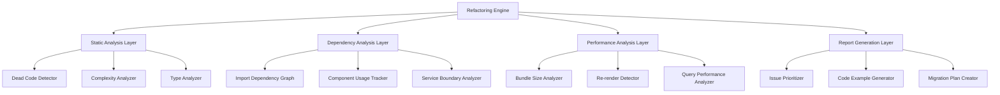

# Design para Refatoração de Sistema Complexo

## Overview

Este documento apresenta o design para uma refatoração abrangente do sistema financeiro pessoal, focando na redução de complexidade, eliminação de código morto e otimização de performance. O sistema atual possui mais de 20 hooks customizados, múltiplos serviços sobrepostos e componentes com responsabilidades mal definidas, resultando em um bundle JavaScript de tamanho excessivo e dificuldades de manutenção.

## Architecture

### Arquitetura do Motor de Refatoração



### Camadas de Análise

1. **Camada de Análise Estática**
   - Análise de AST (Abstract Syntax Tree) usando ts-morph
   - Detecção de código morto e imports não utilizados
   - Cálculo de métricas de complexidade ciclomática
   - Identificação de padrões anti-pattern

2. **Camada de Análise de Dependências**
   - Construção de grafo de dependências completo
   - Detecção de dependências circulares
   - Análise de acoplamento entre módulos
   - Identificação de oportunidades de consolidação

3. **Camada de Análise de Performance**
   - Análise de tamanho de bundle e tree-shaking
   - Detecção de re-renders desnecessários
   - Identificação de computações pesadas
   - Análise de padrões de queries ineficientes

4. **Camada de Geração de Relatórios**
   - Priorização baseada em impacto vs esforço
   - Geração de exemplos de código antes/depois
   - Criação de planos de migração incrementais
   - Estimativas de esforço e benefícios

## Components and Interfaces

### Motor de Refatoração Principal

```typescript
interface RefactoringEngine {
  analyzeCodebase(rootPath: string): Promise<AnalysisResult>;
  generateRefactoringPlan(analysis: AnalysisResult): RefactoringPlan;
  applyRefactoring(plan: RefactoringPlan, options: RefactoringOptions): Promise<RefactoringResult>;
  validateRefactoring(result: RefactoringResult): ValidationReport;
}

interface AnalysisResult {
  deadCode: DeadCodeReport;
  complexity: ComplexityReport;
  dependencies: DependencyReport;
  performance: PerformanceReport;
  types: TypeReport;
  structure: StructureReport;
}

interface DeadCodeReport {
  unusedImports: UnusedImport[];
  orphanedComponents: OrphanedComponent[];
  unusedHooks: UnusedHook[];
  unusedTypes: UnusedType[];
  totalSavings: {
    linesOfCode: number;
    bundleSize: number;
    files: number;
  };
}
```

### Analisador de Complexidade

```typescript
interface ComplexityAnalyzer {
  analyzeComponent(component: ComponentNode): ComponentComplexity;
  analyzeHook(hook: HookNode): HookComplexity;
  analyzeService(service: ServiceNode): ServiceComplexity;
  calculateOverallComplexity(codebase: CodebaseNode): OverallComplexity;
}

interface ComponentComplexity {
  cyclomaticComplexity: number;
  linesOfCode: number;
  numberOfProps: number;
  numberOfHooks: number;
  numberOfChildren: number;
  responsibilities: Responsibility[];
  decompositionSuggestions: DecompositionSuggestion[];
}

interface DecompositionSuggestion {
  type: 'EXTRACT_COMPONENT' | 'EXTRACT_HOOK' | 'SPLIT_RESPONSIBILITIES';
  description: string;
  extractedCode: string;
  remainingCode: string;
  benefits: string[];
  effort: 'LOW' | 'MEDIUM' | 'HIGH';
}
```

### Analisador de Dependências

```typescript
interface DependencyAnalyzer {
  buildDependencyGraph(codebase: CodebaseNode): DependencyGraph;
  detectCircularDependencies(graph: DependencyGraph): CircularDependency[];
  analyzeServiceBoundaries(services: ServiceNode[]): BoundaryAnalysis;
  identifyConsolidationOpportunities(graph: DependencyGraph): ConsolidationOpportunity[];
}

interface DependencyGraph {
  nodes: DependencyNode[];
  edges: DependencyEdge[];
  clusters: DependencyCluster[];
}

interface ConsolidationOpportunity {
  type: 'MERGE_HOOKS' | 'MERGE_SERVICES' | 'EXTRACT_SHARED_UTILITY';
  targets: string[];
  sharedFunctionality: string[];
  consolidatedInterface: string;
  migrationSteps: MigrationStep[];
}
```

### Analisador de Performance

```typescript
interface PerformanceAnalyzer {
  analyzeBundleSize(codebase: CodebaseNode): BundleSizeReport;
  detectRerenderIssues(components: ComponentNode[]): RerenderIssue[];
  analyzeComputationalComplexity(functions: FunctionNode[]): ComputationReport;
  identifyOptimizationOpportunities(codebase: CodebaseNode): OptimizationOpportunity[];
}

interface BundleSizeReport {
  totalSize: number;
  heavyDependencies: HeavyDependency[];
  unusedDependencies: string[];
  treeshakingOpportunities: TreeshakingOpportunity[];
  lazLoadingCandidates: LazyLoadingCandidate[];
}

interface OptimizationOpportunity {
  type: 'MEMOIZATION' | 'LAZY_LOADING' | 'CODE_SPLITTING' | 'TREE_SHAKING';
  location: CodeLocation;
  description: string;
  expectedImprovement: PerformanceImprovement;
  implementation: string;
}
```

## Data Models

### Modelo de Relatório de Refatoração

```typescript
interface RefactoringReport {
  id: string;
  timestamp: Date;
  codebaseSnapshot: CodebaseSnapshot;
  analysis: AnalysisResult;
  recommendations: Recommendation[];
  prioritizedPlan: PrioritizedPlan;
  estimatedBenefits: EstimatedBenefits;
}

interface Recommendation {
  id: string;
  title: string;
  description: string;
  category: 'DEAD_CODE' | 'COMPLEXITY' | 'PERFORMANCE' | 'STRUCTURE' | 'TYPES';
  priority: 'CRITICAL' | 'HIGH' | 'MEDIUM' | 'LOW';
  effort: 'SMALL' | 'MEDIUM' | 'LARGE';
  impact: 'HIGH' | 'MEDIUM' | 'LOW';
  codeExample: CodeExample;
  dependencies: string[];
  risks: Risk[];
}

interface CodeExample {
  before: string;
  after: string;
  explanation: string;
  benefits: string[];
  breakingChanges: string[];
}

interface EstimatedBenefits {
  bundleSizeReduction: number; // percentage
  performanceImprovement: number; // percentage
  maintainabilityScore: number; // 1-10
  codeReduction: number; // lines of code
  complexityReduction: number; // percentage
}
```

### Modelo de Plano de Migração

```typescript
interface MigrationPlan {
  phases: MigrationPhase[];
  totalEstimatedTime: number; // hours
  riskAssessment: RiskAssessment;
  rollbackStrategy: RollbackStrategy;
  validationChecklist: ValidationItem[];
}

interface MigrationPhase {
  id: string;
  name: string;
  description: string;
  tasks: MigrationTask[];
  dependencies: string[];
  estimatedTime: number; // hours
  riskLevel: 'LOW' | 'MEDIUM' | 'HIGH';
  validationSteps: ValidationStep[];
}

interface MigrationTask {
  id: string;
  description: string;
  type: 'REMOVE' | 'MODIFY' | 'CONSOLIDATE' | 'EXTRACT' | 'OPTIMIZE';
  files: string[];
  automatable: boolean;
  testingRequired: boolean;
  rollbackProcedure: string;
}
```

## Correctness Properties

*A property is a characteristic or behavior that should hold true across all valid executions of a system-essentially, a formal statement about what the system should do. Properties serve as the bridge between human-readable specifications and machine-verifiable correctness guarantees.*

### Property Reflection

Após análise dos critérios de aceitação, identifiquei várias propriedades que podem ser consolidadas para evitar redundância:

- Propriedades de detecção de código morto (1.1-1.4) podem ser consolidadas em uma propriedade geral de detecção abrangente
- Propriedades de consolidação (2.1-2.3, 4.1-4.3) podem ser agrupadas por tipo de análise
- Propriedades de preservação de funcionalidade (2.4, 3.5, 4.5, 10.1-10.5) podem ser consolidadas em propriedades de preservação geral
- Propriedades de otimização (5.1-5.3, 8.1-8.3) podem ser combinadas por domínio de otimização
- Propriedades de relatório (9.1-9.5) podem ser consolidadas em uma propriedade de qualidade de relatório

### Core Properties

**Property 1: Detecção Abrangente de Código Morto**
*For any* codebase analysis, all unused elements (imports, components, hooks, types) should be correctly identified without false positives or false negatives
**Validates: Requirements 1.1, 1.2, 1.3, 1.4**

**Property 2: Preservação de Funcionalidade Durante Refatoração**
*For any* refactoring operation, all existing component interfaces, business logic, and user workflows should remain unchanged and all tests should continue to pass
**Validates: Requirements 2.4, 3.5, 4.5, 10.1, 10.2, 10.3, 10.4, 10.5**

**Property 3: Consolidação Segura de Código Duplicado**
*For any* consolidation operation (hooks, services, types), the merged result should preserve all original functionality while eliminating duplication
**Validates: Requirements 2.1, 2.2, 2.3, 4.1, 4.2, 6.1, 6.2**

**Property 4: Decomposição Válida de Componentes Complexos**
*For any* component with complexity score above threshold, proposed decompositions should reduce complexity while maintaining the same props interface and behavior
**Validates: Requirements 3.1, 3.2, 3.3, 3.4**

**Property 5: Otimização Mensurável de Performance**
*For any* performance optimization, the system should achieve measurable improvements (bundle size, load times, re-renders) while maintaining all functionality
**Validates: Requirements 5.1, 5.2, 5.3, 5.4, 5.5, 8.1, 8.2, 8.3, 8.4, 8.5**

**Property 6: Consolidação Segura de Tipos TypeScript**
*For any* type consolidation, the unified types should maintain strict type safety across all usage points and automatically update import statements
**Validates: Requirements 6.3, 6.4, 6.5**

**Property 7: Reorganização Automática de Estrutura**
*For any* file reorganization, all import paths should be automatically updated and the final structure should follow established best practices
**Validates: Requirements 7.1, 7.2, 7.3, 7.4, 7.5**

**Property 8: Geração de Plano de Refatoração Seguro**
*For any* identified issue, the generated removal or modification plan should include dependency analysis to prevent breaking changes
**Validates: Requirements 1.5, 2.5**

**Property 9: Relatório Abrangente de Qualidade**
*For any* completed analysis, the generated report should include severity levels, impact assessments, code examples, effort estimates, and optimal prioritization
**Validates: Requirements 9.1, 9.2, 9.3, 9.4, 9.5**

## Error Handling

### Estratégia de Tratamento de Erros

1. **Erros de Análise Estática**
   - Arquivos TypeScript com sintaxe inválida
   - Dependências circulares não resolvíveis
   - Tipos conflitantes ou ambíguos
   - Timeout em análises de codebases muito grandes

2. **Erros de Refatoração**
   - Falhas na aplicação de mudanças automáticas
   - Conflitos de merge em arquivos modificados
   - Quebra de testes após refatoração
   - Perda de funcionalidade durante consolidação

3. **Erros de Validação**
   - Regressões detectadas em testes automatizados
   - Incompatibilidades de tipos após consolidação
   - Performance degradada após otimizações
   - Funcionalidade quebrada após reorganização

### Mecanismos de Recuperação

```typescript
interface ErrorRecovery {
  createCodebaseSnapshot(): SnapshotResult;
  validateChanges(): ValidationResult;
  rollbackChanges(snapshotId: string): RollbackResult;
  generateErrorReport(): ErrorReport;
}

interface SafetyChecks {
  verifyTypesSafety(): boolean;
  validateAllTestsPass(): TestResult[];
  checkPerformanceRegression(): PerformanceComparison;
  confirmFunctionalityIntact(): FunctionalityReport;
}
```

## Testing Strategy

### Abordagem Dual de Testes

**Testes Unitários:**
- Validação de funções específicas de análise
- Casos extremos e condições de erro
- Integração entre componentes do motor de refatoração
- Validação de transformações de código

**Testes Baseados em Propriedades:**
- Verificação de propriedades universais de correção
- Cobertura abrangente através de randomização
- Validação de invariantes do sistema
- Testes de regressão automatizados

### Configuração de Testes de Propriedade

- **Framework:** fast-check para TypeScript
- **Iterações mínimas:** 100 por teste de propriedade
- **Formato de tag:** `Feature: refatoracao-sistema-complexo, Property {number}: {property_text}`
- **Cobertura:** Cada propriedade de correção deve ter um teste correspondente

### Exemplos de Testes

```typescript
// Property 1: Detecção Abrangente de Código Morto
describe('Dead Code Detection', () => {
  it('should identify all unused elements without false positives', 
    fc.property(
      fc.codebaseGenerator(),
      (codebase) => {
        const analysis = refactoringEngine.analyzeCodebase(codebase);
        const actualUnused = findActualUnusedElements(codebase);
        const actualUsed = findActualUsedElements(codebase);
        
        // All actually unused elements should be detected
        expect(analysis.deadCode.unusedImports).toContainAll(actualUnused.imports);
        expect(analysis.deadCode.orphanedComponents).toContainAll(actualUnused.components);
        expect(analysis.deadCode.unusedHooks).toContainAll(actualUnused.hooks);
        expect(analysis.deadCode.unusedTypes).toContainAll(actualUnused.types);
        
        // No false positives for used elements
        expect(analysis.deadCode.unusedImports).not.toContainAny(actualUsed.imports);
        expect(analysis.deadCode.orphanedComponents).not.toContainAny(actualUsed.components);
        expect(analysis.deadCode.unusedHooks).not.toContainAny(actualUsed.hooks);
        expect(analysis.deadCode.unusedTypes).not.toContainAny(actualUsed.types);
      }
    )
  );
});

// Property 2: Preservação de Funcionalidade
describe('Functionality Preservation', () => {
  it('should maintain all interfaces and behavior during refactoring',
    fc.property(
      fc.codebaseWithTests(),
      fc.refactoringOperation(),
      (codebase, operation) => {
        const originalInterfaces = extractComponentInterfaces(codebase);
        const originalTestResults = runAllTests(codebase);
        
        const refactoredCodebase = refactoringEngine.applyRefactoring(codebase, operation);
        const newInterfaces = extractComponentInterfaces(refactoredCodebase);
        const newTestResults = runAllTests(refactoredCodebase);
        
        // All component interfaces should remain unchanged
        expect(newInterfaces).toEqual(originalInterfaces);
        
        // All tests should continue to pass
        expect(newTestResults.passed).toEqual(originalTestResults.passed);
        expect(newTestResults.failed).toHaveLength(0);
      }
    )
  );
});

// Property 5: Otimização Mensurável de Performance
describe('Performance Optimization', () => {
  it('should achieve measurable improvements while maintaining functionality',
    fc.property(
      fc.codebaseWithPerformanceIssues(),
      (codebase) => {
        const originalMetrics = measurePerformance(codebase);
        const optimizations = refactoringEngine.identifyOptimizations(codebase);
        const optimizedCodebase = refactoringEngine.applyOptimizations(codebase, optimizations);
        const newMetrics = measurePerformance(optimizedCodebase);
        
        // Bundle size should be reduced
        expect(newMetrics.bundleSize).toBeLessThan(originalMetrics.bundleSize);
        
        // Performance should improve or stay the same
        expect(newMetrics.loadTime).toBeLessThanOrEqual(originalMetrics.loadTime);
        expect(newMetrics.renderTime).toBeLessThanOrEqual(originalMetrics.renderTime);
        
        // Functionality should be preserved
        const functionalityCheck = validateFunctionality(optimizedCodebase);
        expect(functionalityCheck.allFeaturesWorking).toBe(true);
      }
    )
  );
});
```

### Estratégia de Validação

1. **Testes de Análise Estática**
   - Validação de detecção de código morto
   - Verificação de cálculos de complexidade
   - Testes de análise de dependências

2. **Testes de Refatoração**
   - Preservação de funcionalidade após mudanças
   - Integridade de tipos após consolidação
   - Compatibilidade com código existente

3. **Testes de Performance**
   - Benchmarks antes e depois das otimizações
   - Validação de melhorias de bundle size
   - Testes de regressão de performance

4. **Testes de Integração**
   - Funcionamento end-to-end do motor de refatoração
   - Compatibilidade entre diferentes tipos de análise
   - Validação de planos de migração gerados

### Critérios de Aceitação

- ✅ Todos os testes de propriedade passam com 100+ iterações
- ✅ Cobertura de código > 90% para lógica de análise
- ✅ Zero regressões em funcionalidade existente
- ✅ Melhoria mensurável em métricas de performance (>20% bundle size)
- ✅ Redução comprovada em complexidade do código (>30% complexity score)
- ✅ Eliminação de pelo menos 80% do código morto identificado