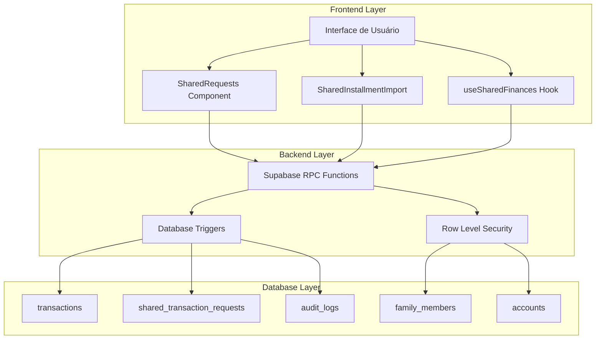

# Design Document: Sistema Compartilhado Reestruturado

## Overview

Este documento detalha o design para uma reestruturação completa do sistema de transações compartilhadas, focando em resolver problemas críticos de visibilidade, sincronização e permissões. O sistema será redesenhado com arquitetura robusta, operações atômicas e mecanismos de recuperação automática.

## Architecture

### Arquitetura Geral



### Princípios Arquiteturais

1. **Operações Atômicas**: Todas as operações compartilhadas são transacionais
2. **Eventual Consistency**: Sistema tolera falhas temporárias com recuperação automática
3. **Audit Trail**: Todas as operações são logadas para debugging e compliance
4. **Idempotência**: Operações podem ser repetidas sem efeitos colaterais
5. **Fail-Safe**: Sistema degrada graciosamente em caso de falhas

## Components and Interfaces

### 1. Database Schema Consolidado

#### Tabela `transactions` (Consolidada)
```sql
CREATE TABLE public.transactions (
    id UUID PRIMARY KEY DEFAULT gen_random_uuid(),
    user_id UUID NOT NULL REFERENCES auth.users(id),
    description TEXT NOT NULL,
    amount NUMERIC(15,2) NOT NULL,
    type TEXT NOT NULL CHECK (type IN ('RECEITA', 'DESPESA', 'TRANSFERÊNCIA')),
    category TEXT NOT NULL,
    date DATE NOT NULL,
    account_id UUID REFERENCES public.accounts(id),
    destination_account_id UUID REFERENCES public.accounts(id),
    trip_id UUID REFERENCES public.trips(id),
    currency TEXT DEFAULT 'BRL',
    
    -- Campos de Compartilhamento
    is_shared BOOLEAN DEFAULT FALSE,
    payer_id TEXT, -- 'me' ou UUID do usuário que pagou
    shared_with JSONB DEFAULT '[]'::jsonb,
    is_settled BOOLEAN DEFAULT FALSE,
    settled_at TIMESTAMPTZ,
    
    -- Campos de Parcelamento
    is_installment BOOLEAN DEFAULT FALSE,
    current_installment INTEGER,
    total_installments INTEGER,
    series_id UUID,
    original_amount NUMERIC(15,2),
    
    -- Campos de Sistema
    domain TEXT DEFAULT 'PERSONAL' CHECK (domain IN ('PERSONAL', 'TRAVEL', 'SHARED', 'BUSINESS')),
    created_at TIMESTAMPTZ DEFAULT NOW(),
    updated_at TIMESTAMPTZ DEFAULT NOW(),
    deleted BOOLEAN DEFAULT FALSE,
    sync_status TEXT DEFAULT 'SYNCED',
    
    -- Constraints
    CONSTRAINT valid_installment_data CHECK (
        (is_installment = FALSE) OR 
        (is_installment = TRUE AND current_installment > 0 AND total_installments > 0 AND current_installment <= total_installments)
    ),
    CONSTRAINT valid_transfer CHECK (
        (type != 'TRANSFERÊNCIA') OR 
        (type = 'TRANSFERÊNCIA' AND destination_account_id IS NOT NULL)
    )
);
```

#### Tabela `shared_transaction_requests` (Aprimorada)
```sql
CREATE TABLE public.shared_transaction_requests (
    id UUID PRIMARY KEY DEFAULT gen_random_uuid(),
    transaction_id UUID NOT NULL REFERENCES public.transactions(id) ON DELETE CASCADE,
    requester_id UUID NOT NULL REFERENCES auth.users(id),
    invited_user_id UUID REFERENCES auth.users(id),
    invited_email TEXT NOT NULL,
    assigned_amount NUMERIC(15,2) NOT NULL,
    status TEXT NOT NULL DEFAULT 'PENDING' CHECK (status IN ('PENDING', 'ACCEPTED', 'REJECTED', 'EXPIRED')),
    created_at TIMESTAMPTZ DEFAULT NOW(),
    responded_at TIMESTAMPTZ,
    expires_at TIMESTAMPTZ DEFAULT (NOW() + INTERVAL '7 days'),
    retry_count INTEGER DEFAULT 0,
    last_retry_at TIMESTAMPTZ,
    error_message TEXT,
    
    -- Metadados para auditoria
    request_metadata JSONB DEFAULT '{}'::jsonb,
    
    CONSTRAINT valid_amount CHECK (assigned_amount > 0)
);
```

#### Tabela `shared_transaction_mirrors` (Nova)
```sql
CREATE TABLE public.shared_transaction_mirrors (
    id UUID PRIMARY KEY DEFAULT gen_random_uuid(),
    original_transaction_id UUID NOT NULL REFERENCES public.transactions(id) ON DELETE CASCADE,
    mirror_transaction_id UUID NOT NULL REFERENCES public.transactions(id) ON DELETE CASCADE,
    mirror_user_id UUID NOT NULL REFERENCES auth.users(id),
    sync_status TEXT DEFAULT 'SYNCED' CHECK (sync_status IN ('SYNCED', 'PENDING', 'ERROR')),
    last_sync_at TIMESTAMPTZ DEFAULT NOW(),
    sync_error TEXT,
    
    UNIQUE(original_transaction_id, mirror_user_id)
);
```

### 2. Core RPC Functions

#### `create_shared_transaction_v2`
```sql
CREATE OR REPLACE FUNCTION public.create_shared_transaction_v2(
    p_description TEXT,
    p_amount NUMERIC,
    p_category TEXT,
    p_date DATE,
    p_account_id UUID,
    p_shared_splits JSONB, -- [{"user_id": "uuid", "amount": 100.50, "email": "user@email.com"}]
    p_trip_id UUID DEFAULT NULL,
    p_installment_data JSONB DEFAULT NULL -- {"total": 12, "series_id": "uuid"}
) RETURNS JSONB;
```

#### `respond_to_shared_request_v2`
```sql
CREATE OR REPLACE FUNCTION public.respond_to_shared_request_v2(
    p_request_id UUID,
    p_status TEXT, -- 'ACCEPTED' | 'REJECTED'
    p_account_id UUID DEFAULT NULL -- Required for ACCEPTED
) RETURNS JSONB;
```

#### `sync_shared_transaction_v2`
```sql
CREATE OR REPLACE FUNCTION public.sync_shared_transaction_v2(
    p_transaction_id UUID
) RETURNS JSONB;
```

### 3. Frontend Components Refatorados

#### SharedTransactionManager (Novo)
```typescript
interface SharedTransactionManager {
    // Criação de transações compartilhadas
    createSharedTransaction(data: CreateSharedTransactionRequest): Promise<CreateSharedTransactionResponse>;
    
    // Importação de parcelas compartilhadas
    importSharedInstallments(data: ImportSharedInstallmentsRequest): Promise<ImportSharedInstallmentsResponse>;
    
    // Resposta a solicitações
    respondToRequest(requestId: string, response: 'ACCEPTED' | 'REJECTED', accountId?: string): Promise<void>;
    
    // Sincronização manual
    syncTransaction(transactionId: string): Promise<SyncResult>;
    
    // Recuperação de falhas
    retryFailedOperations(): Promise<RetryResult[]>;
}
```

#### SharedRequestsV2 Component
```typescript
interface SharedRequestsV2Props {
    currentUserId: string;
    accounts: Account[];
    onStatusChange: () => void;
    onError: (error: SharedSystemError) => void;
}

interface SharedRequest {
    id: string;
    transaction: {
        id: string;
        description: string;
        amount: number;
        currency: string;
        date: string;
        category: string;
    };
    requester: {
        id: string;
        name: string;
        email: string;
    };
    assignedAmount: number;
    status: 'PENDING' | 'ACCEPTED' | 'REJECTED' | 'EXPIRED';
    createdAt: string;
    expiresAt: string;
}
```

## Data Models

### Modelos TypeScript Atualizados

```typescript
// Modelo base para operações compartilhadas
interface SharedOperationResult {
    success: boolean;
    data?: any;
    error?: {
        code: string;
        message: string;
        details?: any;
    };
    warnings?: string[];
}

// Request para criar transação compartilhada
interface CreateSharedTransactionRequest {
    description: string;
    amount: number;
    category: Category;
    date: string;
    accountId: string;
    splits: SharedTransactionSplit[];
    tripId?: string;
    installmentData?: {
        totalInstallments: number;
        seriesId?: string;
    };
}

interface SharedTransactionSplit {
    userId?: string; // UUID se usuário já existe
    email: string;   // Email para convite
    amount: number;
    percentage?: number;
}

// Response da criação
interface CreateSharedTransactionResponse extends SharedOperationResult {
    data?: {
        transactionId: string;
        requestIds: string[];
        mirrorTransactionIds: string[];
    };
}

// Modelo para sincronização
interface SyncResult extends SharedOperationResult {
    data?: {
        syncedTransactions: number;
        failedTransactions: number;
        errors: SyncError[];
    };
}

interface SyncError {
    transactionId: string;
    error: string;
    retryable: boolean;
}

// Estados de erro específicos do sistema compartilhado
enum SharedSystemErrorCode {
    INVALID_USER = 'INVALID_USER',
    INSUFFICIENT_PERMISSIONS = 'INSUFFICIENT_PERMISSIONS',
    SYNC_FAILURE = 'SYNC_FAILURE',
    NETWORK_ERROR = 'NETWORK_ERROR',
    DATA_INCONSISTENCY = 'DATA_INCONSISTENCY',
    TIMEOUT = 'TIMEOUT'
}

interface SharedSystemError {
    code: SharedSystemErrorCode;
    message: string;
    transactionId?: string;
    userId?: string;
    retryable: boolean;
    details?: any;
}
```

## Correctness Properties

*A property is a characteristic or behavior that should hold true across all valid executions of a system-essentially, a formal statement about what the system should do. Properties serve as the bridge between human-readable specifications and machine-verifiable correctness guarantees.*

### Property 1: Database Cleanup Completeness
*For any* database cleanup operation, after completion the system should have no duplicate migrations, exactly one version of each critical function, and all integrity tests should pass
**Validates: Requirements 1.1, 1.2, 1.5**

### Property 2: Backup Data Preservation
*For any* cleanup operation, all original data should be preserved in backups and be fully recoverable
**Validates: Requirements 1.3**

### Property 3: Index Optimization Completeness
*For any* schema consolidation, all necessary indexes for shared transaction queries should exist and be optimized
**Validates: Requirements 1.4**

### Property 4: Shared Installment Visibility
*For any* shared installment created or imported, it should appear in the debtor user's transaction list and all mirror transactions should be created correctly
**Validates: Requirements 2.1, 2.2, 2.3**

### Property 5: Synchronization Recovery
*For any* synchronization failure, the system should automatically recover and ensure data consistency between all involved users
**Validates: Requirements 2.4, 2.5**

### Property 6: Edit Permission Enforcement
*For any* shared transaction, the original payer should have full edit permissions, debtors should only modify payment status, and all changes should propagate correctly to mirror transactions
**Validates: Requirements 3.1, 3.2, 3.3**

### Property 7: Change Notification Consistency
*For any* modification to shared transactions, all involved users should be notified, and payer changes should take priority in conflicts
**Validates: Requirements 3.4, 3.5**

### Property 8: Atomic Request Operations
*For any* sharing request operation (send, accept, reject), the operation should be atomic - either fully complete or fully rolled back with proper cleanup
**Validates: Requirements 4.1, 4.2, 4.3, 4.4**

### Property 9: Request Lifecycle Management
*For any* sharing request that remains pending beyond the timeout period, automatic reminders should be sent
**Validates: Requirements 4.5**

### Property 10: Robust Data Synchronization
*For any* data change in shared transactions, synchronization should occur in real-time with automatic retry and exponential backoff on failures, plus automatic reconciliation for detected inconsistencies
**Validates: Requirements 5.1, 5.2, 5.3**

### Property 11: Sync Failure Alerting
*For any* repeated synchronization failures, alerts should be sent to users and administrators
**Validates: Requirements 5.4**

### Property 12: Data Integrity Validation
*For any* data recovery operation, integrity should be validated before applying changes
**Validates: Requirements 5.5**

### Property 13: UI Feedback Completeness
*For any* shared transaction operation, the UI should provide clear status display, real-time feedback, progress indicators, and automatic updates
**Validates: Requirements 6.1, 6.2, 6.4, 6.5**

### Property 14: Error Message Clarity
*For any* error in the shared system, clear error messages and corrective actions should be displayed to users
**Validates: Requirements 6.3**

### Property 15: Comprehensive Logging
*For any* system operation, structured logs with complete context should be recorded, and errors should include stack traces and contextual data
**Validates: Requirements 7.1, 7.2**

### Property 16: Metrics Collection Completeness
*For any* metrics collection, latency, success rate, and operation volume should be included
**Validates: Requirements 7.3**

### Property 17: Automated Alerting
*For any* detected problem, automatic alerts should be generated
**Validates: Requirements 7.4**

### Property 18: Report Analysis Completeness
*For any* generated report, trend analysis and pattern recognition should be included
**Validates: Requirements 7.5**

### Property 19: Test Coverage Completeness
*For any* code change, unit tests should run for all critical functions, integration tests should validate complete sharing flows, and error scenarios should verify proper recovery
**Validates: Requirements 8.1, 8.2, 8.3**

### Property 20: Performance Validation
*For any* performance test, response times should be within acceptable limits
**Validates: Requirements 8.4**

### Property 21: Data Integrity Testing
*For any* data test, integrity and consistency should be verified
**Validates: Requirements 8.5**

## Error Handling

### Error Classification

```typescript
enum SharedSystemErrorType {
    // Recoverable errors
    NETWORK_TIMEOUT = 'NETWORK_TIMEOUT',
    SYNC_CONFLICT = 'SYNC_CONFLICT',
    TEMPORARY_UNAVAILABLE = 'TEMPORARY_UNAVAILABLE',
    
    // User errors
    INVALID_PERMISSIONS = 'INVALID_PERMISSIONS',
    INVALID_DATA = 'INVALID_DATA',
    USER_NOT_FOUND = 'USER_NOT_FOUND',
    
    // System errors
    DATABASE_ERROR = 'DATABASE_ERROR',
    CONSTRAINT_VIOLATION = 'CONSTRAINT_VIOLATION',
    INTERNAL_ERROR = 'INTERNAL_ERROR'
}
```

### Error Recovery Strategies

1. **Automatic Retry**: Network timeouts, temporary unavailability
2. **User Intervention**: Invalid permissions, user not found
3. **System Rollback**: Database errors, constraint violations
4. **Manual Resolution**: Data conflicts, integrity violations

### Circuit Breaker Pattern

```typescript
class SharedSystemCircuitBreaker {
    private failureCount = 0;
    private lastFailureTime = 0;
    private state: 'CLOSED' | 'OPEN' | 'HALF_OPEN' = 'CLOSED';
    
    async execute<T>(operation: () => Promise<T>): Promise<T> {
        if (this.state === 'OPEN') {
            if (Date.now() - this.lastFailureTime > this.timeout) {
                this.state = 'HALF_OPEN';
            } else {
                throw new Error('Circuit breaker is OPEN');
            }
        }
        
        try {
            const result = await operation();
            this.onSuccess();
            return result;
        } catch (error) {
            this.onFailure();
            throw error;
        }
    }
}
```

## Testing Strategy

### Dual Testing Approach

O sistema utilizará uma abordagem dupla de testes para garantir cobertura completa:

- **Unit Tests**: Verificam exemplos específicos, casos extremos e condições de erro
- **Property Tests**: Verificam propriedades universais através de todos os inputs

Ambos os tipos de teste são complementares e necessários para cobertura abrangente.

### Property-Based Testing Configuration

- **Framework**: fast-check para TypeScript/JavaScript
- **Iterações mínimas**: 100 por teste de propriedade
- **Tag format**: **Feature: shared-system-overhaul, Property {number}: {property_text}**
- Cada propriedade de correção deve ser implementada por um ÚNICO teste baseado em propriedades

### Test Categories

#### 1. Database Layer Tests
```typescript
// Property test example
describe('Database Cleanup Properties', () => {
    it('should have no duplicate functions after cleanup', 
       property(fc.anything(), async () => {
           // Feature: shared-system-overhaul, Property 1: Database Cleanup Completeness
           await cleanupDatabase();
           const functions = await getDatabaseFunctions();
           const duplicates = findDuplicates(functions);
           expect(duplicates).toHaveLength(0);
       })
    );
});
```

#### 2. Synchronization Tests
```typescript
describe('Synchronization Properties', () => {
    it('should sync all changes between users',
       property(fc.record({
           userId: fc.uuid(),
           transactionData: fc.record({...})
       }), async (data) => {
           // Feature: shared-system-overhaul, Property 10: Robust Data Synchronization
           const transaction = await createSharedTransaction(data);
           await waitForSync();
           const mirrorTransactions = await getMirrorTransactions(transaction.id);
           expect(mirrorTransactions).toHaveLength(data.sharedWith.length);
       })
    );
});
```

#### 3. Permission Tests
```typescript
describe('Permission Properties', () => {
    it('should enforce edit permissions correctly',
       property(fc.record({
           payerUserId: fc.uuid(),
           debtorUserId: fc.uuid(),
           editData: fc.record({...})
       }), async (data) => {
           // Feature: shared-system-overhaul, Property 6: Edit Permission Enforcement
           const transaction = await createSharedTransaction(data);
           
           // Payer should be able to edit everything
           await expect(editTransaction(transaction.id, data.editData, data.payerUserId))
               .resolves.not.toThrow();
           
           // Debtor should only edit payment status
           await expect(editTransaction(transaction.id, {description: 'new'}, data.debtorUserId))
               .rejects.toThrow('Insufficient permissions');
       })
    );
});
```

#### 4. Integration Tests
```typescript
describe('End-to-End Shared Transaction Flow', () => {
    it('should complete full sharing workflow', async () => {
        // Create users and accounts
        const payer = await createTestUser();
        const debtor = await createTestUser();
        
        // Create shared transaction
        const transaction = await createSharedTransaction({
            payerId: payer.id,
            debtorId: debtor.id,
            amount: 100.00
        });
        
        // Verify request was sent
        const requests = await getSharedRequests(debtor.id);
        expect(requests).toHaveLength(1);
        
        // Accept request
        await respondToRequest(requests[0].id, 'ACCEPTED', debtor.defaultAccountId);
        
        // Verify mirror transaction was created
        const debtorTransactions = await getTransactions(debtor.id);
        expect(debtorTransactions).toContainEqual(
            expect.objectContaining({
                amount: 100.00,
                type: 'DESPESA',
                isShared: true
            })
        );
    });
});
```

### Performance Testing

```typescript
describe('Performance Requirements', () => {
    it('should handle concurrent shared transactions', async () => {
        const startTime = Date.now();
        
        const promises = Array.from({length: 100}, () => 
            createSharedTransaction(generateRandomTransactionData())
        );
        
        await Promise.all(promises);
        
        const duration = Date.now() - startTime;
        expect(duration).toBeLessThan(5000); // 5 seconds max
    });
});
```

### Error Simulation Tests

```typescript
describe('Error Recovery Properties', () => {
    it('should recover from network failures',
       property(fc.record({
           transactionData: fc.record({...}),
           failureCount: fc.integer({min: 1, max: 5})
       }), async (data) => {
           // Feature: shared-system-overhaul, Property 10: Robust Data Synchronization
           
           // Simulate network failures
           mockNetworkFailures(data.failureCount);
           
           const result = await createSharedTransaction(data.transactionData);
           
           // Should eventually succeed with retry
           expect(result.success).toBe(true);
           expect(result.retryCount).toBeGreaterThan(0);
       })
    );
});
```

### Test Data Generators

```typescript
// Smart generators for property testing
const transactionGenerator = fc.record({
    description: fc.string({minLength: 1, maxLength: 100}),
    amount: fc.float({min: 0.01, max: 10000, noNaN: true}),
    category: fc.constantFrom(...Object.values(Category)),
    date: fc.date({min: new Date('2020-01-01'), max: new Date('2030-12-31')}),
    splits: fc.array(fc.record({
        userId: fc.uuid(),
        amount: fc.float({min: 0.01, max: 1000})
    }), {minLength: 1, maxLength: 5})
});

const userGenerator = fc.record({
    id: fc.uuid(),
    email: fc.emailAddress(),
    name: fc.string({minLength: 2, maxLength: 50})
});
```

### Continuous Testing

- Testes executam automaticamente em cada commit
- Testes de propriedade executam com seeds diferentes a cada execução
- Falhas são reportadas com contraexemplos específicos para debugging
- Métricas de cobertura incluem tanto unit tests quanto property tests