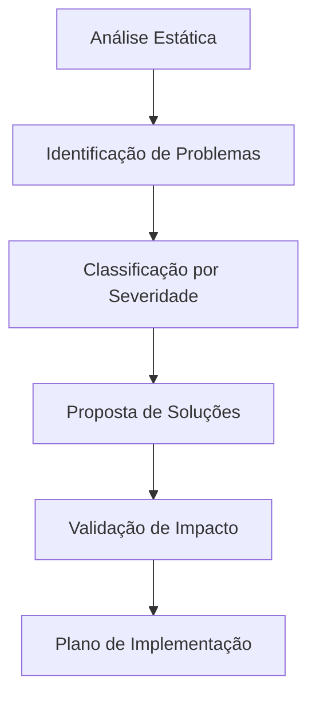

# Design para Reestruturação do Sistema Financeiro Pessoal

## Overview

Este documento apresenta o design para uma análise completa e reestruturação do sistema financeiro pessoal existente. O objetivo é identificar e eliminar complexidade desnecessária, código morto e over-engineering, resultando em um sistema mais simples, maintível e performático.

## Architecture

### Análise em Camadas

A reestruturação será realizada em 4 camadas principais:

1. **Camada de Apresentação (Frontend)**
   - Componentes React/TypeScript
   - Hooks customizados
   - Gerenciamento de estado
   - Formulários e validações

2. **Camada de Lógica de Negócio**
   - Serviços e utilitários
   - Cálculos financeiros
   - Validações de regras de negócio
   - Transformações de dados

3. **Camada de Dados (Backend)**
   - Schema do banco de dados
   - Funções RPC do Supabase
   - Triggers e constraints
   - Índices e otimizações

4. **Camada de Integração**
   - APIs e clientes
   - Tipos TypeScript
   - Mapeamento de dados
   - Tratamento de erros

### Metodologia de Análise



## Components and Interfaces

### Analisador de Código Frontend

```typescript
interface FrontendAnalyzer {
  analyzeComponents(): ComponentAnalysis[];
  analyzeHooks(): HookAnalysis[];
  analyzeTypes(): TypeAnalysis[];
  analyzeImports(): ImportAnalysis[];
  detectDeadCode(): DeadCodeReport[];
}

interface ComponentAnalysis {
  componentName: string;
  filePath: string;
  complexity: ComplexityLevel;
  issues: Issue[];
  suggestions: Suggestion[];
  usageCount: number;
  dependencies: string[];
}

interface Issue {
  type: 'DEAD_CODE' | 'OVER_ENGINEERING' | 'DUPLICATION' | 'PERFORMANCE' | 'MAINTAINABILITY';
  severity: 'LOW' | 'MEDIUM' | 'HIGH' | 'CRITICAL';
  description: string;
  location: CodeLocation;
  impact: string;
}
```

### Analisador de Banco de Dados

```typescript
interface DatabaseAnalyzer {
  analyzeTables(): TableAnalysis[];
  analyzeIndexes(): IndexAnalysis[];
  analyzeFunctions(): FunctionAnalysis[];
  analyzeTriggers(): TriggerAnalysis[];
  analyzeConstraints(): ConstraintAnalysis[];
}

interface TableAnalysis {
  tableName: string;
  columnCount: number;
  unusedColumns: string[];
  redundantColumns: string[];
  missingIndexes: string[];
  oversizedColumns: string[];
  suggestions: OptimizationSuggestion[];
}
```

### Analisador de Lógica de Negócio

```typescript
interface BusinessLogicAnalyzer {
  analyzeCalculations(): CalculationAnalysis[];
  analyzeValidations(): ValidationAnalysis[];
  analyzeTransformations(): TransformationAnalysis[];
  detectDuplication(): DuplicationReport[];
}

interface CalculationAnalysis {
  functionName: string;
  complexity: number;
  duplicatedLogic: string[];
  performanceIssues: string[];
  consolidationOpportunities: string[];
}
```

## Data Models

### Modelo de Relatório de Análise

```typescript
interface AnalysisReport {
  id: string;
  timestamp: Date;
  systemVersion: string;
  summary: AnalysisSummary;
  frontend: FrontendReport;
  backend: BackendReport;
  businessLogic: BusinessLogicReport;
  recommendations: Recommendation[];
}

interface AnalysisSummary {
  totalIssues: number;
  criticalIssues: number;
  codeReductionPotential: number; // percentage
  performanceImprovementPotential: number; // percentage
  maintainabilityScore: number; // 1-10
}

interface Recommendation {
  id: string;
  title: string;
  description: string;
  category: 'REMOVAL' | 'SIMPLIFICATION' | 'CONSOLIDATION' | 'OPTIMIZATION';
  priority: 'LOW' | 'MEDIUM' | 'HIGH' | 'CRITICAL';
  effort: 'SMALL' | 'MEDIUM' | 'LARGE';
  impact: 'LOW' | 'MEDIUM' | 'HIGH';
  dependencies: string[];
  codeExample?: CodeExample;
}

interface CodeExample {
  before: string;
  after: string;
  explanation: string;
}
```

### Modelo de Categorização Simplificada

```typescript
interface SimplifiedCategorySystem {
  expenses: CategoryGroup[];
  income: CategoryGroup[];
  transfers: CategoryGroup[];
}

interface CategoryGroup {
  groupName: string;
  icon: string;
  categories: SimpleCategory[];
  isDefault?: boolean;
}

interface SimpleCategory {
  id: string;
  name: string;
  icon: string;
  transactionType: 'EXPENSE' | 'INCOME' | 'TRANSFER';
  group: string;
}
```

## Correctness Properties

*A property is a characteristic or behavior that should hold true across all valid executions of a system-essentially, a formal statement about what the system should do. Properties serve as the bridge between human-readable specifications and machine-verifiable correctness guarantees.*

### Property Reflection

Após análise dos critérios de aceitação, identifiquei várias propriedades que podem ser consolidadas para evitar redundância:

- Propriedades de detecção de código morto (2.1-2.4) podem ser consolidadas em uma propriedade geral
- Propriedades de análise de componentes (1.1, 1.3, 1.4) podem ser agrupadas por tipo de análise
- Propriedades de documentação (7.1-7.3) podem ser combinadas em uma propriedade de formato de relatório
- Propriedades de preservação de funcionalidade (8.1-8.4) podem ser consolidadas

### Core Properties

**Property 1: Detecção Abrangente de Código Morto**
*For any* codebase analysis, all unused elements (imports, components, functions, types) should be correctly identified and marked for safe removal
**Validates: Requirements 2.1, 2.2, 2.3, 2.4**

**Property 2: Identificação de Duplicação e Complexidade**
*For any* code analysis, duplicated logic and over-engineered components should be detected across all layers (frontend, backend, business logic)
**Validates: Requirements 1.1, 1.2, 1.4, 5.1, 5.3**

**Property 3: Categorização Contextual de Transações**
*For any* transaction type selection, only relevant categories should be displayed and grouped logically by transaction type, while preserving existing form structure
**Validates: Requirements 3.1, 3.2, 3.3**

**Property 4: Otimização de Estrutura de Dados**
*For any* database schema analysis, unused columns, redundant indexes, and unnecessary relationships should be identified
**Validates: Requirements 4.1, 4.2, 4.3**

**Property 5: Consolidação de Lógica de Negócio**
*For any* business logic analysis, similar validation rules and calculation patterns should be identified for consolidation
**Validates: Requirements 5.2, 5.5**

**Property 6: Detecção de Problemas de Performance**
*For any* performance analysis, inefficient queries, unnecessary re-renders, and oversized bundles should be identified
**Validates: Requirements 6.1, 6.2, 6.3, 6.4**

**Property 7: Documentação Estruturada de Melhorias**
*For any* analysis report, all problems should include severity, impact, context, code examples, and implementation phases
**Validates: Requirements 1.5, 7.1, 7.2, 7.3, 7.4**

**Property 8: Preservação de Funcionalidade Essencial**
*For any* refactoring proposal, core CRUD operations should be preserved while non-essential features are identified for removal
**Validates: Requirements 8.1, 8.2, 8.3, 8.4**

**Property 9: Geração de Plano de Implementação**
*For any* analysis completion, a prioritized implementation plan with risk assessment should be generated
**Validates: Requirements 2.5, 4.5, 6.5, 7.5, 8.5**

**Property 10: Preservação de Estrutura de Formulários**
*For any* form analysis, the existing form structure and all current fields should be preserved without modification
**Validates: Requirements 3.4, 3.5**

<function_calls>
<invoke name="prework">
<parameter name="featureName">sistema-financeiro-reestruturacao

## Error Handling

### Estratégia de Tratamento de Erros

1. **Erros de Análise**
   - Arquivos corrompidos ou ilegíveis
   - Dependências circulares
   - Sintaxe inválida
   - Timeout em análises longas

2. **Erros de Validação**
   - Schema de banco inconsistente
   - Tipos TypeScript conflitantes
   - Referências quebradas
   - Configurações inválidas

3. **Erros de Implementação**
   - Falhas em migrações
   - Perda de dados
   - Quebra de funcionalidade
   - Rollback necessário

### Mecanismos de Recuperação

```typescript
interface ErrorRecovery {
  createBackup(): BackupResult;
  validateChanges(): ValidationResult;
  rollbackChanges(): RollbackResult;
  reportIssues(): IssueReport[];
}

interface SafetyChecks {
  verifyDataIntegrity(): boolean;
  validateFunctionality(): TestResult[];
  checkPerformanceRegression(): PerformanceReport;
  confirmUserAcceptance(): boolean;
}
```

## Testing Strategy

### Abordagem Dual de Testes

**Testes Unitários:**
- Validação de funções específicas de análise
- Casos extremos e condições de erro
- Integração entre componentes
- Validação de transformações de dados

**Testes Baseados em Propriedades:**
- Verificação de propriedades universais
- Cobertura abrangente através de randomização
- Validação de invariantes do sistema
- Testes de regressão automatizados

### Configuração de Testes de Propriedade

- **Framework:** fast-check para TypeScript
- **Iterações mínimas:** 100 por teste de propriedade
- **Formato de tag:** `Feature: sistema-financeiro-reestruturacao, Property {number}: {property_text}`
- **Cobertura:** Cada propriedade de correção deve ter um teste correspondente

### Exemplos de Testes

```typescript
// Property 1: Detecção de Código Morto
describe('Dead Code Detection', () => {
  it('should identify all unused elements', 
    fc.property(
      fc.codebaseGenerator(),
      (codebase) => {
        const analysis = analyzer.analyzeDeadCode(codebase);
        const actualUnused = findActualUnusedElements(codebase);
        
        // All actually unused elements should be detected
        expect(analysis.unusedElements).toContainAll(actualUnused);
        
        // No false positives for used elements
        const usedElements = findUsedElements(codebase);
        expect(analysis.unusedElements).not.toContainAny(usedElements);
      }
    )
  );
});

// Property 3: Categorização Contextual
describe('Transaction Categorization', () => {
  it('should show only relevant categories by transaction type',
    fc.property(
      fc.transactionType(),
      fc.categorySystem(),
      (transactionType, categorySystem) => {
        const availableCategories = getAvailableCategories(transactionType, categorySystem);
        
        // All returned categories should match the transaction type
        availableCategories.forEach(category => {
          expect(category.transactionType).toBe(transactionType);
        });
        
        // Should include all categories of the correct type
        const expectedCategories = categorySystem.filter(c => c.transactionType === transactionType);
        expect(availableCategories).toContainAll(expectedCategories);
      }
    )
  );
});
```

### Estratégia de Validação

1. **Testes de Análise Estática**
   - Validação de detecção de código morto
   - Verificação de identificação de duplicação
   - Testes de análise de complexidade

2. **Testes de Funcionalidade**
   - Preservação de operações CRUD
   - Integridade de dados após mudanças
   - Compatibilidade com dados existentes

3. **Testes de Performance**
   - Benchmarks antes e depois
   - Validação de otimizações propostas
   - Testes de carga e stress

4. **Testes de Integração**
   - Funcionamento end-to-end
   - Compatibilidade entre camadas
   - Validação de APIs e contratos

### Critérios de Aceitação

- ✅ Todos os testes de propriedade passam com 100+ iterações
- ✅ Cobertura de código > 90% para lógica de análise
- ✅ Zero regressões em funcionalidade existente
- ✅ Melhoria mensurável em métricas de performance
- ✅ Redução comprovada em complexidade do código