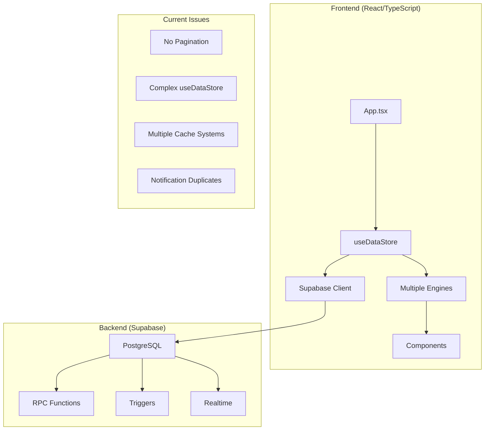
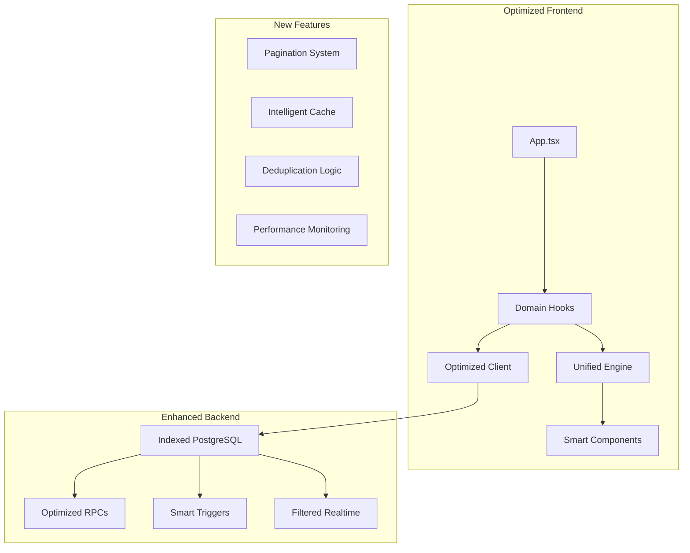

# Design Document - Análise e Otimização do Sistema Financeiro

## Overview

Este documento detalha a arquitetura e implementação das melhorias identificadas para o sistema de gestão financeira. O foco principal é resolver problemas de performance, simplificar a arquitetura e melhorar a confiabilidade, mantendo compatibilidade com o sistema existente.

A estratégia de implementação segue uma abordagem incremental, priorizando melhorias de alto impacto com baixo risco. Cada componente será refatorado de forma isolada, permitindo rollback seguro se necessário.

## Architecture

### Current State Analysis

O sistema atual apresenta uma arquitetura sólida mas com alguns pontos de complexidade:



### Target Architecture

A arquitetura otimizada implementa separação de responsabilidades e otimizações de performance:



## Components and Interfaces

### 1. Database Optimization Layer

#### PaginationService
```typescript
interface PaginationConfig {
  pageSize: number;
  sortField: string;
  sortDirection: 'asc' | 'desc';
  filters?: Record<string, any>;
}

interface PaginatedResult<T> {
  data: T[];
  pagination: {
    currentPage: number;
    totalPages: number;
    totalItems: number;
    hasNext: boolean;
    hasPrevious: boolean;
  };
}

class PaginationService {
  async getTransactionsPaginated(
    userId: string,
    config: PaginationConfig
  ): Promise<PaginatedResult<Transaction>>;
  
  async getAccountTransactions(
    accountId: string,
    config: PaginationConfig
  ): Promise<PaginatedResult<Transaction>>;
}
```

#### QueryOptimizer
```typescript
interface QueryMetrics {
  executionTime: number;
  rowsScanned: number;
  indexesUsed: string[];
}

class QueryOptimizer {
  async analyzeQuery(query: string): Promise<QueryMetrics>;
  async suggestIndexes(tableName: string): Promise<string[]>;
  async monitorSlowQueries(): Promise<QueryMetrics[]>;
}
```

### 2. Intelligent Caching System

#### CacheManager
```typescript
interface CacheConfig {
  ttl: number;
  maxSize: number;
  strategy: 'LRU' | 'LFU' | 'TTL';
}

interface CacheEntry<T> {
  data: T;
  timestamp: number;
  accessCount: number;
  dependencies: string[];
}

class CacheManager {
  async get<T>(key: string): Promise<T | null>;
  async set<T>(key: string, data: T, dependencies?: string[]): Promise<void>;
  async invalidate(pattern: string): Promise<void>;
  async invalidateByDependency(dependency: string): Promise<void>;
  getStats(): CacheStats;
}
```

#### SmartPreloader
```typescript
interface PreloadStrategy {
  trigger: 'navigation' | 'idle' | 'user-action';
  priority: 'high' | 'medium' | 'low';
  condition: (context: any) => boolean;
}

class SmartPreloader {
  registerStrategy(name: string, strategy: PreloadStrategy): void;
  async preloadData(context: any): Promise<void>;
  async predictNextData(userBehavior: UserBehavior): Promise<string[]>;
}
```

### 3. Modular State Management

#### Domain-Specific Hooks
```typescript
// useAccountsData.ts
interface AccountsState {
  accounts: Account[];
  loading: boolean;
  error: string | null;
}

export const useAccountsData = () => {
  const [state, setState] = useState<AccountsState>();
  
  const actions = {
    loadAccounts: async () => Promise<void>,
    createAccount: async (account: Omit<Account, 'id'>) => Promise<Account>,
    updateAccount: async (account: Account) => Promise<void>,
    deleteAccount: async (id: string) => Promise<void>
  };
  
  return { ...state, ...actions };
};

// useTransactionsData.ts
interface TransactionsState {
  transactions: Transaction[];
  pagination: PaginationState;
  filters: TransactionFilters;
  loading: boolean;
}

export const useTransactionsData = () => {
  // Similar structure for transactions
};
```

#### Unified Financial Engine
```typescript
interface FinancialCalculations {
  calculateAccountBalance(accountId: string, transactions: Transaction[]): number;
  calculateNetWorth(accounts: Account[]): number;
  calculateCashFlow(transactions: Transaction[], period: DateRange): CashFlow;
  calculateProjections(data: FinancialData, months: number): Projection[];
}

class UnifiedFinancialEngine implements FinancialCalculations {
  private precision = new FinancialPrecision();
  private cache = new Map<string, any>();
  
  // Consolidated calculation methods
  calculateAccountBalance(accountId: string, transactions: Transaction[]): number {
    const cacheKey = `balance_${accountId}_${this.getTransactionsHash(transactions)}`;
    return this.cache.get(cacheKey) ?? this.computeBalance(accountId, transactions);
  }
}
```

### 4. Enhanced Notification System

#### NotificationDeduplicator
```typescript
interface NotificationRule {
  type: string;
  uniqueFields: string[];
  mergeStrategy: 'replace' | 'aggregate' | 'ignore';
  ttl: number;
}

class NotificationDeduplicator {
  private rules = new Map<string, NotificationRule>();
  
  async processNotification(notification: Notification): Promise<boolean>;
  async cleanupExpired(): Promise<number>;
  async mergeNotifications(existing: Notification, new: Notification): Promise<Notification>;
}
```

#### SmartNotificationManager
```typescript
interface NotificationContext {
  userId: string;
  preferences: NotificationPreferences;
  recentActivity: UserActivity[];
}

class SmartNotificationManager {
  async shouldSendNotification(
    notification: Notification,
    context: NotificationContext
  ): Promise<boolean>;
  
  async scheduleCleanup(criteria: CleanupCriteria): Promise<void>;
  async syncNotificationState(): Promise<void>;
}
```

### 5. Robust Shared System

#### SharedTransactionOrchestrator
```typescript
interface SharedTransactionOperation {
  type: 'create' | 'update' | 'settle' | 'sync';
  transactionId: string;
  participants: string[];
  retryPolicy: RetryPolicy;
}

class SharedTransactionOrchestrator {
  async executeOperation(operation: SharedTransactionOperation): Promise<OperationResult>;
  async handleFailure(operation: SharedTransactionOperation, error: Error): Promise<void>;
  async syncMirrorTransactions(originalId: string): Promise<SyncResult>;
  async validateConsistency(transactionId: string): Promise<ValidationResult>;
}
```

## Data Models

### Enhanced Transaction Model
```typescript
interface OptimizedTransaction extends Transaction {
  // Performance fields
  searchVector?: string; // For full-text search
  computedHash?: string; // For change detection
  lastSyncAt?: Date;
  
  // Caching metadata
  cacheVersion?: number;
  dependentCaches?: string[];
}
```

### Pagination Metadata
```typescript
interface PaginationMetadata {
  totalCount: number;
  pageSize: number;
  currentPage: number;
  sortField: string;
  sortDirection: 'asc' | 'desc';
  filters: Record<string, any>;
  cacheKey: string;
  generatedAt: Date;
}
```

### Performance Metrics
```typescript
interface PerformanceMetrics {
  queryTime: number;
  renderTime: number;
  cacheHitRate: number;
  memoryUsage: number;
  errorRate: number;
  userSatisfactionScore: number;
}
```

## Error Handling

### Graceful Degradation Strategy
```typescript
interface FallbackStrategy {
  primary: () => Promise<any>;
  fallback: () => Promise<any>;
  condition: (error: Error) => boolean;
}

class ErrorRecoveryManager {
  async executeWithFallback<T>(strategy: FallbackStrategy): Promise<T>;
  async handleDatabaseTimeout(): Promise<void>;
  async recoverFromCacheFailure(): Promise<void>;
  async syncAfterNetworkReconnect(): Promise<void>;
}
```

### Retry Logic
```typescript
interface RetryConfig {
  maxAttempts: number;
  backoffStrategy: 'linear' | 'exponential' | 'fixed';
  baseDelay: number;
  maxDelay: number;
  retryableErrors: string[];
}

class RetryManager {
  async executeWithRetry<T>(
    operation: () => Promise<T>,
    config: RetryConfig
  ): Promise<T>;
}
```

## Correctness Properties

*A property is a characteristic or behavior that should hold true across all valid executions of a system-essentially, a formal statement about what the system should do. Properties serve as the bridge between human-readable specifications and machine-verifiable correctness guarantees.*

### Performance Properties

**Property 1: System Response Time Bounds**
*For any* user interaction with the system, response times should meet defined thresholds: dashboard loading ≤ 2s, month navigation ≤ 1s, transaction filtering ≤ 500ms
**Validates: Requirements 1.1, 1.2, 1.6**

**Property 2: Pagination Activation**
*For any* dataset with more than 1000 transactions, the system should automatically implement pagination to prevent performance degradation
**Validates: Requirements 1.3**

**Property 3: Query Optimization Usage**
*For any* database query executed, the system should utilize appropriate indexes and return execution plans showing index usage
**Validates: Requirements 1.4, 5.1, 5.4**

**Property 4: Efficient Data Loading**
*For any* view or component, only data necessary for the current visualization should be loaded from the database
**Validates: Requirements 1.5, 5.3**

### Notification System Properties

**Property 5: Notification Deduplication**
*For any* set of similar notifications generated within a time window, the system should prevent duplicates based on unique criteria
**Validates: Requirements 2.1, 2.6**

**Property 6: Notification Cleanup Completeness**
*For any* user action to clear notifications, all marked notifications should be removed from both UI and database
**Validates: Requirements 2.2**

**Property 7: Automatic Notification Management**
*For any* shared expense settlement or notification older than 30 days, the system should automatically remove related notifications
**Validates: Requirements 2.3, 2.4**

**Property 8: Real-time Notification Sync**
*For any* notification state change, all connected clients should reflect the update within 1 second
**Validates: Requirements 2.5**

### Cache System Properties

**Property 9: Cache Behavior Consistency**
*For any* cached data, the system should respect TTL settings, serve cached data faster than database queries, and maintain synchronization with the source
**Validates: Requirements 4.1, 4.3, 4.5**

**Property 10: Cache Invalidation Correctness**
*For any* data modification, all related cache entries should be invalidated automatically to prevent stale data
**Validates: Requirements 4.2**

**Property 11: Intelligent Preloading**
*For any* user navigation pattern, the system should preload probable next data based on usage patterns
**Validates: Requirements 4.6**

### Database Optimization Properties

**Property 12: Query Efficiency Standards**
*For any* database operation, the system should use efficient filters, implement server-side aggregations, and monitor performance metrics
**Validates: Requirements 5.2, 5.5, 5.6**

### Shared System Properties

**Property 13: Atomic Shared Operations**
*For any* shared transaction operation, the system should ensure atomicity (all-or-nothing) and validate data consistency before confirmation
**Validates: Requirements 6.1, 6.3**

**Property 14: Failure Recovery Mechanisms**
*For any* synchronization failure, the system should implement automatic retry with backoff and notify users when manual intervention is required
**Validates: Requirements 6.2, 6.6**

**Property 15: Shared System Auditability**
*For any* shared transaction operation, the system should create complete audit logs and resolve conflicts automatically when possible
**Validates: Requirements 6.4, 6.5**

### Monitoring and Observability Properties

**Property 16: Comprehensive System Monitoring**
*For any* critical operation, the system should generate structured logs, monitor response times, and provide health dashboard information
**Validates: Requirements 7.1, 7.2, 7.6**

**Property 17: Proactive Error Detection**
*For any* performance degradation or system error, the system should generate alerts and track errors with adequate context
**Validates: Requirements 7.3, 7.4**

**Property 18: Usage Analytics Collection**
*For any* user interaction, the system should collect relevant metrics for future optimization without impacting performance
**Validates: Requirements 7.5**

### Compatibility and Migration Properties

**Property 19: Backward Compatibility Preservation**
*For any* system update or refactoring, existing data formats and API interfaces should continue to function without modification
**Validates: Requirements 3.6, 8.1, 8.4**

**Property 20: Safe Migration Operations**
*For any* database migration, the operation should be reversible, validate data integrity post-migration, and implement automatic rollback on critical failures
**Validates: Requirements 8.2, 8.3, 8.5**

**Property 21: User Communication Clarity**
*For any* system change, users should receive clear communication about modifications and their impact
**Validates: Requirements 8.6**

### User Experience Properties

**Property 22: UI Responsiveness Maintenance**
*For any* data loading operation, the user interface should remain responsive and provide appropriate visual feedback
**Validates: Requirements 9.1, 9.2**

**Property 23: Granular Loading States**
*For any* component with loading dependencies, loading states should be independent and interface state should persist during navigation
**Validates: Requirements 9.3, 9.4**

**Property 24: Graceful Error Recovery**
*For any* error condition, the system should recover gracefully and maintain optimal performance on mobile devices
**Validates: Requirements 9.5, 9.6**

### Security and Integrity Properties

**Property 25: Input Validation Completeness**
*For any* data input, the backend should validate all entries before persistence and implement granular access controls
**Validates: Requirements 10.1, 10.2**

**Property 26: Security Audit Trail**
*For any* sensitive operation, the system should create audit logs and implement data integrity verification
**Validates: Requirements 10.3, 10.4**

**Property 27: Concurrency Protection**
*For any* concurrent operations, the system should prevent race conditions and ensure data can be recovered from backups
**Validates: Requirements 10.5, 10.6**

## Testing Strategy

### Property-Based Testing Framework
- **Test Library**: Use `fast-check` for TypeScript property-based testing
- **Test Configuration**: Minimum 100 iterations per property test
- **Test Tagging**: Each test tagged with **Feature: system-analysis, Property N: [property_text]**

### Performance Testing
- **Load Testing**: Validate pagination and response times under load
- **Stress Testing**: Test cache limits and memory usage
- **Benchmark Testing**: Compare performance metrics before/after optimizations

### Integration Testing
- **Database Integration**: Validate optimized queries and index usage
- **Cache Integration**: Test invalidation patterns and synchronization
- **Notification Integration**: Verify deduplication and cleanup mechanisms

### Unit Testing Balance
- **Property Tests**: Focus on universal behaviors and mathematical properties
- **Unit Tests**: Cover specific examples, edge cases, and integration points
- **Both Required**: Property tests verify general correctness, unit tests catch concrete bugs
