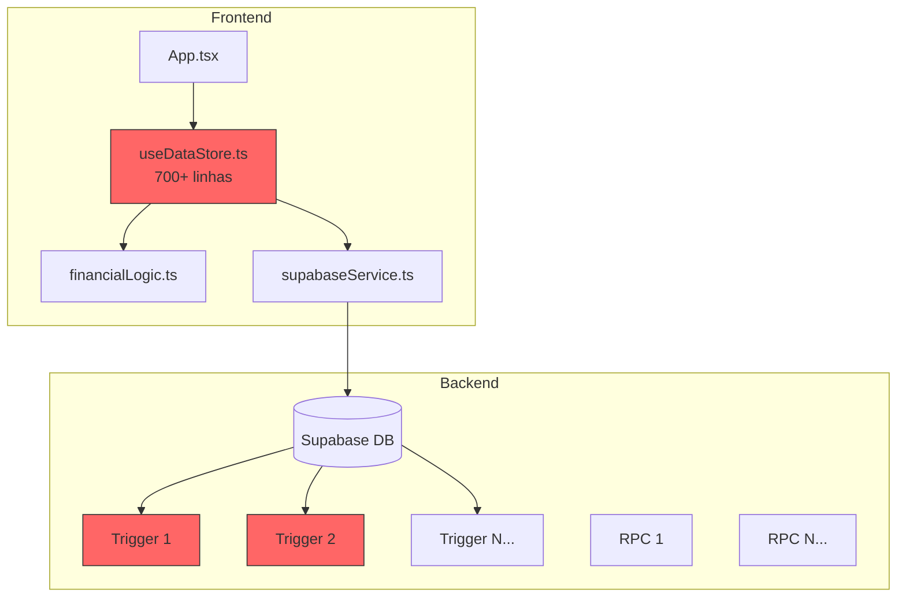
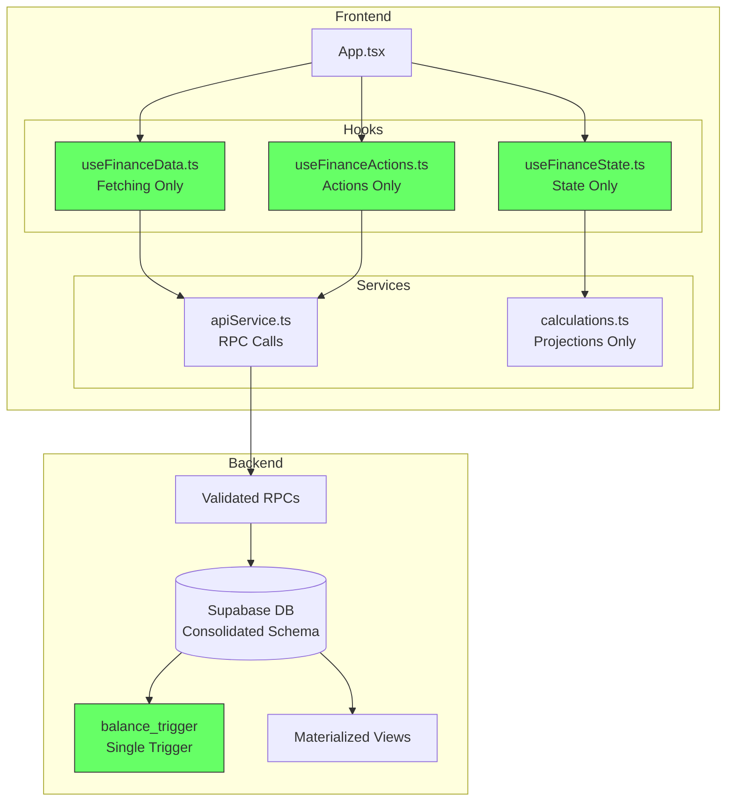

# Design Document: System Restructure

## Overview

Este documento descreve a arquitetura e design para a reestruturação completa do sistema financeiro "Pé de Meia". O objetivo é criar uma base de código limpa, performática e manutenível, eliminando os problemas de flicker, inconsistência de dados e código legado.

A reestruturação segue os princípios de:
- **Single Source of Truth**: Cada dado tem uma única fonte autoritativa
- **Backend-First Validation**: Toda validação crítica acontece no banco de dados
- **Atomic Operations**: Operações que afetam múltiplas entidades são atômicas
- **Progressive Loading**: Dados são carregados de forma inteligente sem causar flicker

## Architecture

### Arquitetura Atual (Problemas)



**Problemas:**
- useDataStore mistura fetching, state, e business logic
- Múltiplos triggers conflitantes
- Cálculos de saldo duplicados (frontend + backend)
- 78+ migrations com lógica sobreposta

### Arquitetura Proposta



## Components and Interfaces

### Frontend Components

#### 1. useFinanceData (Data Fetching)

```typescript
interface UseFinanceDataReturn {
  // Data
  accounts: Account[];
  transactions: Transaction[];
  trips: Trip[];
  familyMembers: FamilyMember[];
  
  // Loading States
  isInitialLoading: boolean;
  isLoadingPeriod: boolean;
  
  // Actions
  loadPeriod: (date: Date) => Promise<void>;
  refresh: () => Promise<void>;
}

// Responsabilidades:
// - Fetch inicial de dados (accounts + current month)
// - Lazy loading de períodos históricos
// - Cache de períodos carregados
// - NÃO gerencia state local
```

#### 2. useFinanceState (State Management)

```typescript
interface UseFinanceStateReturn {
  // Computed Values (from stored data, no recalculation)
  totalBalance: number;
  totalIncome: number;
  totalExpenses: number;
  
  // Projections (calculated locally)
  projectedBalance: number;
  pendingReceivables: number;
  pendingPayables: number;
  
  // Filters
  currentDate: Date;
  setCurrentDate: (date: Date) => void;
}

// Responsabilidades:
// - Derivar valores computados dos dados
// - Calcular projeções (único lugar de cálculo local)
// - Gerenciar filtros e navegação temporal
```

#### 3. useFinanceActions (Mutations)

```typescript
interface UseFinanceActionsReturn {
  // Transaction Actions
  createTransaction: (tx: CreateTransactionInput) => Promise<Result<Transaction>>;
  updateTransaction: (tx: UpdateTransactionInput) => Promise<Result<Transaction>>;
  deleteTransaction: (id: string, scope: 'SINGLE' | 'SERIES') => Promise<Result<void>>;
  
  // Account Actions
  createAccount: (acc: CreateAccountInput) => Promise<Result<Account>>;
  updateAccount: (acc: UpdateAccountInput) => Promise<Result<Account>>;
  deleteAccount: (id: string) => Promise<Result<void>>;
  
  // Shared Actions
  settleDebt: (splitId: string, accountId: string) => Promise<Result<void>>;
}

// Responsabilidades:
// - Chamar RPCs validados
// - Retornar Result<T> com sucesso ou erro tipado
// - NÃO fazer optimistic updates arriscados
```

#### 4. apiService (RPC Layer)

```typescript
interface ApiService {
  // Transactions
  createTransaction(input: CreateTransactionRPC): Promise<{ id: string }>;
  updateTransaction(input: UpdateTransactionRPC): Promise<void>;
  deleteTransaction(id: string): Promise<void>;
  deleteTransactionSeries(seriesId: string): Promise<void>;
  
  // Accounts
  getAccountsWithBalances(): Promise<AccountWithBalance[]>;
  
  // Queries
  getTransactionsByPeriod(start: string, end: string): Promise<Transaction[]>;
  getUnsettledSplits(): Promise<Split[]>;
  
  // Reconciliation
  reconcileBalances(): Promise<ReconciliationResult>;
}
```

### Backend Components

#### 1. Consolidated Schema

```sql
-- Tabelas principais com tipos corretos
CREATE TABLE accounts (
    id UUID PRIMARY KEY DEFAULT gen_random_uuid(),
    user_id UUID NOT NULL REFERENCES auth.users(id) ON DELETE CASCADE,
    name TEXT NOT NULL,
    type TEXT NOT NULL,
    balance NUMERIC NOT NULL DEFAULT 0,
    currency TEXT NOT NULL DEFAULT 'BRL',
    -- Indexes
    CONSTRAINT accounts_user_idx UNIQUE (user_id, name)
);

CREATE TABLE transactions (
    id UUID PRIMARY KEY DEFAULT gen_random_uuid(),
    user_id UUID NOT NULL REFERENCES auth.users(id) ON DELETE CASCADE,
    account_id UUID REFERENCES accounts(id), -- UUID, not TEXT
    destination_account_id UUID REFERENCES accounts(id),
    trip_id UUID REFERENCES trips(id),
    -- ... other fields
    CONSTRAINT valid_transfer CHECK (
        type != 'TRANSFERÊNCIA' OR 
        (account_id IS NOT NULL AND destination_account_id IS NOT NULL AND account_id != destination_account_id)
    )
);

-- Tabela normalizada para splits (substituindo JSONB)
CREATE TABLE transaction_splits (
    id UUID PRIMARY KEY DEFAULT gen_random_uuid(),
    transaction_id UUID NOT NULL REFERENCES transactions(id) ON DELETE CASCADE,
    member_id UUID NOT NULL REFERENCES family_members(id),
    amount NUMERIC NOT NULL,
    percentage NUMERIC,
    is_settled BOOLEAN DEFAULT FALSE,
    settled_at TIMESTAMPTZ,
    settled_by_transaction_id UUID REFERENCES transactions(id),
    created_at TIMESTAMPTZ DEFAULT NOW()
);
```

#### 2. Single Balance Trigger

```sql
CREATE OR REPLACE FUNCTION update_account_balance()
RETURNS TRIGGER AS $$
BEGIN
    -- Handle INSERT
    IF TG_OP = 'INSERT' AND NOT NEW.deleted THEN
        PERFORM apply_balance_change(NEW);
    END IF;
    
    -- Handle UPDATE
    IF TG_OP = 'UPDATE' THEN
        -- Reverse old transaction
        IF NOT OLD.deleted THEN
            PERFORM reverse_balance_change(OLD);
        END IF;
        -- Apply new transaction
        IF NOT NEW.deleted THEN
            PERFORM apply_balance_change(NEW);
        END IF;
    END IF;
    
    -- Handle DELETE (soft delete)
    IF TG_OP = 'UPDATE' AND NEW.deleted AND NOT OLD.deleted THEN
        PERFORM reverse_balance_change(OLD);
    END IF;
    
    RETURN NEW;
END;
$$ LANGUAGE plpgsql;
```

#### 3. Validated RPCs

```sql
CREATE OR REPLACE FUNCTION create_transaction_v2(
    p_description TEXT,
    p_amount NUMERIC,
    p_type TEXT,
    p_category TEXT,
    p_date DATE,
    p_account_id UUID,
    p_destination_account_id UUID DEFAULT NULL,
    p_trip_id UUID DEFAULT NULL,
    p_splits JSONB DEFAULT '[]'
) RETURNS UUID AS $$
DECLARE
    v_user_id UUID := auth.uid();
    v_tx_id UUID;
BEGIN
    -- Validations
    IF p_amount <= 0 THEN
        RAISE EXCEPTION 'Amount must be positive';
    END IF;
    
    IF p_description IS NULL OR trim(p_description) = '' THEN
        RAISE EXCEPTION 'Description is required';
    END IF;
    
    IF p_type = 'TRANSFERÊNCIA' THEN
        IF p_account_id IS NULL OR p_destination_account_id IS NULL THEN
            RAISE EXCEPTION 'Transfer requires both source and destination accounts';
        END IF;
        IF p_account_id = p_destination_account_id THEN
            RAISE EXCEPTION 'Source and destination accounts must be different';
        END IF;
    END IF;
    
    -- Verify account ownership
    IF p_account_id IS NOT NULL THEN
        IF NOT EXISTS (SELECT 1 FROM accounts WHERE id = p_account_id AND user_id = v_user_id AND NOT deleted) THEN
            RAISE EXCEPTION 'Invalid source account';
        END IF;
    END IF;
    
    -- Insert transaction
    INSERT INTO transactions (user_id, description, amount, type, category, date, account_id, destination_account_id, trip_id)
    VALUES (v_user_id, p_description, p_amount, p_type, p_category, p_date, p_account_id, p_destination_account_id, p_trip_id)
    RETURNING id INTO v_tx_id;
    
    -- Create splits if provided
    IF jsonb_array_length(p_splits) > 0 THEN
        INSERT INTO transaction_splits (transaction_id, member_id, amount, percentage)
        SELECT v_tx_id, (s->>'memberId')::UUID, (s->>'amount')::NUMERIC, (s->>'percentage')::NUMERIC
        FROM jsonb_array_elements(p_splits) s;
        
        UPDATE transactions SET is_shared = TRUE WHERE id = v_tx_id;
    END IF;
    
    RETURN v_tx_id;
END;
$$ LANGUAGE plpgsql SECURITY DEFINER;
```

## Data Models

### Account

```typescript
interface Account {
  id: string;
  userId: string;
  name: string;
  type: AccountType;
  balance: number;      // Stored balance (source of truth)
  currency: string;
  limit?: number;       // For credit cards
  closingDay?: number;  // For credit cards
  dueDay?: number;      // For credit cards
  deleted: boolean;
  createdAt: string;
  updatedAt: string;
}
```

### Transaction

```typescript
interface Transaction {
  id: string;
  userId: string;
  description: string;
  amount: number;
  type: TransactionType;
  category: string;
  date: string;
  accountId?: string;
  destinationAccountId?: string;
  tripId?: string;
  currency: string;
  
  // Installments
  isInstallment: boolean;
  currentInstallment?: number;
  totalInstallments?: number;
  seriesId?: string;
  
  // Shared
  isShared: boolean;
  payerId?: string;
  
  // Status
  isSettled: boolean;
  deleted: boolean;
}
```

### TransactionSplit (New - Normalized)

```typescript
interface TransactionSplit {
  id: string;
  transactionId: string;
  memberId: string;
  amount: number;
  percentage?: number;
  isSettled: boolean;
  settledAt?: string;
  settledByTransactionId?: string;
}
```

## Correctness Properties

*A property is a characteristic or behavior that should hold true across all valid executions of a system-essentially, a formal statement about what the system should do. Properties serve as the bridge between human-readable specifications and machine-verifiable correctness guarantees.*

### Property 1: Balance Consistency After Transaction Operations

*For any* account and any sequence of valid transaction operations (create, update, delete), the stored account balance SHALL equal the sum of all non-deleted transactions affecting that account.

**Validates: Requirements 2.2**

### Property 2: Balance Reconciliation Correctness

*For any* account with an artificially introduced balance inconsistency, calling the reconcile function SHALL result in the stored balance matching the calculated sum of transactions.

**Validates: Requirements 2.5**

### Property 3: Backend Validation Rejects Invalid Input

*For any* transaction with invalid data (negative amount, empty description, same source and destination for transfers), the backend SHALL reject the operation with a non-empty error message.

**Validates: Requirements 6.1, 6.2**

### Property 4: Optimistic Update Rollback on Failure

*For any* operation that fails on the backend, the frontend state SHALL be rolled back to the state before the optimistic update was applied.

**Validates: Requirements 4.4**

### Property 5: Atomic Split Creation

*For any* shared transaction creation with N splits, exactly N split records SHALL exist in the transaction_splits table after the operation completes.

**Validates: Requirements 7.2**

### Property 6: Receivables and Payables Calculation

*For any* set of transaction splits, the calculated total receivables SHALL equal the sum of unsettled splits where the current user is the payer, and total payables SHALL equal the sum of unsettled splits where another user is the payer.

**Validates: Requirements 7.3**

### Property 7: Settlement Creates Both Records

*For any* split settlement operation, both the split record SHALL be marked as settled AND a corresponding settlement transaction SHALL exist.

**Validates: Requirements 7.4**

### Property 8: Unsettled Splits Block Deletion

*For any* transaction with at least one unsettled split, attempting to delete the transaction SHALL be rejected with an appropriate error.

**Validates: Requirements 7.5**

## Error Handling

### Backend Errors

```sql
-- Standardized error codes
CREATE TYPE error_code AS ENUM (
    'INVALID_AMOUNT',
    'INVALID_DESCRIPTION',
    'INVALID_ACCOUNT',
    'INVALID_TRANSFER',
    'UNSETTLED_SPLITS',
    'UNAUTHORIZED',
    'NOT_FOUND'
);

-- Error messages in Portuguese
CREATE OR REPLACE FUNCTION get_error_message(code error_code) RETURNS TEXT AS $$
BEGIN
    RETURN CASE code
        WHEN 'INVALID_AMOUNT' THEN 'O valor deve ser maior que zero'
        WHEN 'INVALID_DESCRIPTION' THEN 'A descrição é obrigatória'
        WHEN 'INVALID_ACCOUNT' THEN 'Conta inválida ou não encontrada'
        WHEN 'INVALID_TRANSFER' THEN 'Transferência requer contas de origem e destino diferentes'
        WHEN 'UNSETTLED_SPLITS' THEN 'Não é possível excluir transação com divisões pendentes'
        WHEN 'UNAUTHORIZED' THEN 'Você não tem permissão para esta operação'
        WHEN 'NOT_FOUND' THEN 'Registro não encontrado'
    END;
END;
$$ LANGUAGE plpgsql;
```

### Frontend Error Handling

```typescript
interface ApiError {
  code: string;
  message: string;
  details?: Record<string, unknown>;
}

type Result<T> = 
  | { success: true; data: T }
  | { success: false; error: ApiError };

// Usage
const result = await actions.createTransaction(input);
if (!result.success) {
  toast.error(result.error.message);
  return;
}
// Use result.data
```

## Testing Strategy

### Dual Testing Approach

O sistema utilizará tanto testes unitários quanto testes baseados em propriedades para garantir corretude.

### Unit Tests

- Testes específicos para funções de cálculo de projeção
- Testes de integração para fluxos críticos (criar transação, liquidar dívida)
- Testes de edge cases (valores zero, strings vazias, datas inválidas)

### Property-Based Tests

Utilizaremos **fast-check** como biblioteca de property-based testing para TypeScript.

Cada property-based test será configurado para executar no mínimo 100 iterações.

Cada teste será anotado com o formato: `**Feature: system-restructure, Property {number}: {property_text}**`

#### Generators

```typescript
// Generator para transações válidas
const validTransactionGen = fc.record({
  description: fc.string({ minLength: 1, maxLength: 200 }),
  amount: fc.float({ min: 0.01, max: 1000000, noNaN: true }),
  type: fc.constantFrom('RECEITA', 'DESPESA', 'TRANSFERÊNCIA'),
  category: fc.constantFrom(...Object.values(Category)),
  date: fc.date({ min: new Date('2020-01-01'), max: new Date('2030-12-31') })
});

// Generator para transações inválidas
const invalidTransactionGen = fc.oneof(
  fc.record({ ...validTransactionGen, amount: fc.constant(-1) }),
  fc.record({ ...validTransactionGen, description: fc.constant('') }),
  fc.record({ ...validTransactionGen, description: fc.constant('   ') })
);

// Generator para splits
const splitGen = fc.record({
  memberId: fc.uuid(),
  amount: fc.float({ min: 0.01, max: 10000, noNaN: true }),
  percentage: fc.float({ min: 0, max: 100, noNaN: true })
});
```

#### Test Structure

```typescript
describe('Balance Consistency', () => {
  /**
   * **Feature: system-restructure, Property 1: Balance Consistency After Transaction Operations**
   * **Validates: Requirements 2.2**
   */
  it('should maintain balance consistency after any transaction operation', async () => {
    await fc.assert(
      fc.asyncProperty(
        validTransactionGen,
        fc.constantFrom('create', 'update', 'delete'),
        async (transaction, operation) => {
          // Setup: Get initial balance
          const initialBalance = await getAccountBalance(testAccountId);
          
          // Act: Perform operation
          await performOperation(operation, transaction);
          
          // Assert: Balance equals sum of transactions
          const storedBalance = await getAccountBalance(testAccountId);
          const calculatedBalance = await calculateBalanceFromTransactions(testAccountId);
          
          expect(storedBalance).toBeCloseTo(calculatedBalance, 2);
        }
      ),
      { numRuns: 100 }
    );
  });
});
```
